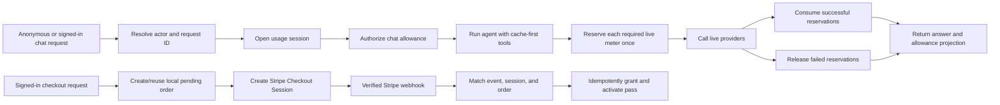

# Implementation Plan

## Source Documents

- Path: `/Users/alexmetelli/.codex/attachments/0074373a-6725-4d34-b7ba-a5d142c9f6b2/pasted-text.txt`
  - Role: Primary monetisation and launch brief.
  - Summary: Defines the free-to-Trip-Pass loop, verified Stripe activation, metered decisions,
    traveler surfaces, operational requirements, and intentionally deferred monetisation channels.
- Path: `/Users/alexmetelli/Downloads/usage_data_2026-06-14_2026-07-13/amount-2026-06-14_2026-07-14.csv`
  - Role: Primary measured DeepSeek usage baseline.
  - Summary: Records 76 V4 Flash calls plus cache-hit, cache-miss, output-token, and unit-price totals
    for the current Ask Siargao API key.
- Path: `/Users/alexmetelli/Downloads/usage_data_2026-06-14_2026-07-13/cost-2026-06-14_2026-07-14.csv`
  - Role: Primary measured DeepSeek cost baseline.
  - Summary: Records $0.111115984 total DeepSeek cost over the export window and supports the
    $0.001462052 observed average API-call cost used as a reference in this plan.
- Path: <https://api-docs.deepseek.com/guides/kv_cache>
  - Role: Supporting provider contract.
  - Summary: Defines automatic prefix caching and the cache-hit/cache-miss usage fields that the
    current compatibility adapter drops.
- Path: <https://api-docs.deepseek.com/guides/thinking_mode>
  - Role: Supporting provider contract.
  - Summary: Defines explicit thinking-mode selection and required reasoning replay across
    thinking-mode tool calls; the current adapter forces thinking-high for every request.
- Path: `AGENTS.md`
  - Role: Repository constraints.
  - Summary: Defines structure, coding conventions, validation commands, security boundaries, and
    semantic evidence-ordering/artifact-selection review requirements.
- Path: `plans/README.md`
  - Role: Supporting execution history.
  - Summary: Records repository executor conventions and the completed aggregate Trip Pass meter
    foundation that this plan extends rather than replaces.
- Path: `CHANGELOG.md`
  - Role: Existing release history.
  - Summary: Keep a Changelog history that must be preserved and extended only for qualifying
    functional changes.

Planned against repository revision `1deb02c` on 2026-07-14. Before executing a step, compare the
current revision and touched paths with this baseline and adapt the step without overwriting
unrelated work.

## Current Product Contract

The version 2 launch contract supersedes the version 1 meter mix elsewhere in this historical plan:

- 10 free Siargao travel answers over seven days.
- One `$9.99` USD Siargao Trip Pass with 150 travel answers for 14 days.
- Weather, surf, Places, events, and public-evidence checks are selected automatically when an
  answer needs them. Travelers do not choose a deep-search mode or spend separate live, research,
  weather, or route allowances.
- Version 1 grants and their specialized meters remain readable for payment-ledger and webhook
  compatibility, but the current chat path enforces only the travel-answer meter.

## Goals

- Launch one understandable monetisation loop: 10 free travel answers, a `$9.99` 14-day paid Trip
  Pass with 150 travel answers, Stripe Checkout, and verified webhook activation.
- Make entitlement, usage, payment, and failure behavior server-authoritative, concurrency-safe,
  request-idempotent, and observable.
- Let a traveler see plan state, remaining allowances, warnings, expiry, checkout status, and safe
  fallback behavior in settings and chat.
- Keep stable local knowledge useful when current providers are unavailable, while clearly labeling
  stale, cached, unavailable, and not-checked evidence.
- Turn Ask Siargao's launch differentiation into shipped behavior: Siargao-specific trip context,
  governed local knowledge, current provider evidence, recommendation cards, and decision-ready
  answers rather than generic destination prose.
- Provide operators with enough diagnostics, reconciliation, documentation, and launch evidence to
  support paid users without reading raw prompts, precise locations, or payment payloads.
- Keep the checkout and extension surfaces feature-flagged until their production configuration and
  release approvals are complete.
- Reduce DeepSeek cost per successful traveler answer without weakening source governance,
  Siargao-specific decision quality, required evidence ordering, or truthful fallback behavior.
- Make casual free-limit resets and automated abuse uneconomic through layered, privacy-safe
  identity, atomic quotas, perimeter controls, account velocity controls, and global cost ceilings.

## Non-Goals

- Accommodation commissions, booking affiliates, sponsored placement, lead marketplaces, operator
  self-service tooling, or other monetisation channels before launch.
- A general-purpose ChatGPT replacement or coverage outside Siargao trip decisions.
- Unlimited paid usage, token-by-token billing, per-tool charges, or client-authoritative counters.
- Native mobile applications, organization/team plans, recurring subscriptions, or an operator CRM.
- Public Trip Pass extensions/top-ups at initial launch. The grant model may support them, but the
  CTA remains disabled until real conversion and consumption data justify it.
- Activating access from a success URL, browser redirect, client assertion, unverified webhook, or
  Stripe object that cannot be matched to a local order.
- Storing raw prompts, precise coordinates, email addresses, raw IP addresses, Stripe secrets, or
  complete webhook payloads in analytics.
- Rewriting the existing trip-risk audit purchase flow. Shared Stripe infrastructure must preserve
  its behavior and tests.
- Perfectly identifying a human across cleared cookies, devices, VPNs, mobile networks, or multiple
  verified accounts; the system should deter and bound abuse without invasive permanent browser
  fingerprinting.
- Shipping the ₱299 Explorer or ₱799 Extended alternatives at launch. They remain pricing
  experiments until the single Trip Pass has real conversion, usage, and provider-cost data.
- Optimising only for the lowest token bill at the expense of required tools, governed evidence,
  safety caveats, recommendation artifacts, accessibility, or answer usefulness.

## Definition of Done

The launch monetisation work is done only when all of the following are true:

- Anonymous travelers can use up to 10 successfully completed travel answers in a rolling
  seven-day window without creating an account or supplying a card.
- Free-limit identity uses a random opaque browser trip identifier plus a server-side HMAC abuse
  key; raw IP and precise location are not persisted as quota identifiers. Clearing the cookie alone
  does not immediately produce another full allowance from the same abuse cohort.
- Signed-in travelers can start exactly one configured Trip Pass checkout flow, and duplicate
  submissions cannot create duplicate effective orders.
- A Trip Pass becomes active only after a verified, relevant Stripe event is idempotently applied to
  the matching local order. Redirects and client state cannot activate it.
- The version 2 launch product grants 14 days and 150 travel answers. Required evidence tools run
  automatically and do not consume separate customer-facing allowances.
- One effective pass is selected deterministically for each Clerk user; expiry is derived from
  `expiresAt`; repeated webhooks, retries, concurrent requests, and provider failures cannot
  double-grant or double-consume allowances.
- A successful request consumes one travel-answer unit regardless of how many supporting evidence
  tools run. Provider/model work that fails before producing a billable successful result releases
  the reservation; a client disconnect after successful server-side work does not create a free
  replay.
- Unavailable provider evidence degrades to governed cached/local evidence with truthful caveats;
  exhausted travel answers return the typed `usage_limit_reached` response and an appropriate Trip
  Pass action.
- Remaining travel answers and warning states are visible through owner-scoped APIs and coherent
  settings/chat UI. Near-limit thresholds are answers <= 20 and expiry <= 48 hours.
- Free traffic is bounded at 3 chat starts per minute, 10 successful chats per day, and 2 concurrent
  chat requests per actor; paid traffic is bounded at 10 chat starts per minute, 30 successful chats
  per day, and 2 concurrent chat requests per actor, independently of remaining plan allowance.
- Refund and dispute events follow the documented launch policy, with idempotent entitlement and
  audit outcomes.
- The shared production quota store is atomic and asynchronous, works across instances, and fails
  closed in production without blocking deterministic in-memory tests.
- Anonymous quotas use a signed HttpOnly trip cookie as the primary identity, a normalized
  HMAC-derived network cohort as a secondary abuse signal, and Vercel IP/JA4 controls as a perimeter
  signal. Shared hotel/carrier networks are challenged or asked to sign in instead of being silently
  treated as one traveler.
- Request idempotency is server-issued or cryptographically bound to actor plus request-body hash;
  replaying one client request ID with different content cannot avoid usage settlement. Atomic
  reservations prevent parallel final-unit overspend.
- Every DeepSeek call exposes normalized usage metadata through the compatibility adapter, including
  cache-hit input, cache-miss input, output, reasoning, model, mode, and upstream request ID. Costs
  are aggregated per traveler request without recording prompt or reasoning content.
- Routine and simple tool-directed turns use explicit non-thinking mode. Thinking mode is reserved
  for an allowlisted heavy-decision policy and preserves required reasoning replay for tool calls.
- The existing 76-call export remains the reference baseline ($0.001462052 average API-call cost,
  66.63% input cache-hit rate). A pre-change fixed-corpus run establishes the comparable
  per-answer baseline; the optimized corpus reduces average cache-miss input tokens and modeled
  DeepSeek cost per successful answer by at least 20% without a decision-quality regression.
- Normal successful fixture turns require no more than 4 DeepSeek calls, while the runtime retains a
  tested absolute termination bound. Free and paid output/turn/tool budgets are explicit, and
  OpenAI fallback cannot silently turn free traffic into unbounded higher-cost traffic.
- Per-actor, per-provider, and global daily cost circuit breakers stop new expensive work before the
  configured budget is exceeded and degrade to safe cached/local or typed unavailable responses.
- Analytics events reach an actual configured sink with sanitized identifiers and no prohibited
  payloads; operator diagnostics can reconcile order, pass, grant, and usage state.
- The 10-case Siargao decision-quality corpus passes, including multi-tool metering, cache fallback,
  provider failure, source disclosure, and mixed recommendation-artifact selection cases.
- Checkout, webhook, entitlement, quota, chat, UI, database, build, and Playwright coverage passes
  the complete quality gate set below.
- Production Stripe Price configuration, product copy, refund/dispute policy, privacy/terms content,
  Redis connectivity, analytics configuration, and the final release runbook are explicitly checked
  before `TRIP_PASS_CHECKOUT_ENABLED` is enabled.

## Assumptions and Open Questions

Implementation should proceed with the conservative defaults below. Items marked **release
approval** do not block code behind a disabled feature flag, but they block enabling checkout.

- **Product identity:** use the versioned internal product code
  `siargao_trip_pass_14d_v2`. A server-owned catalog defines duration and meter grants; Stripe is
  authoritative for the amount and currency of the configured Price.
- **Price:** `$9.99` USD is the version 2 launch positioning. Checkout still resolves the configured
  `STRIPE_TRIP_PASS_PRICE_ID`, whose live amount and currency must be verified before launch.
  **Release approval:** confirm the production Stripe Price is USD 9.99.
- **Cost baseline:** the supplied export contains one API key/user aggregate over three active days,
  not a mapping from model calls to traveler questions. Use its token prices and $0.001462052 average
  API-call cost as a reference only; Step 1A must capture a fixed-corpus, per-answer baseline before
  changing runtime behavior.
- **Unit-economics guardrail:** the 150-chat cap budgets four observed-average DeepSeek calls per
  chat, or approximately $0.88 at full consumption. The current runtime can make more calls, so the
  implementation must enforce explicit budgets rather than treating $0.88 as a guaranteed maximum.
- **Hosting:** use the supplied $15 database plus $20 Vercel monthly fixed cost in operator unit-
  economics reporting. Google Places, OpenAI web research/fallback, payment fees, taxes, refunds,
  and support remain separate measured inputs rather than guessed zero-cost services.
- **Activation:** `startsAt` is the first successfully applied paid webhook timestamp, and
  `expiresAt = startsAt + 14 days`. Delayed redirects do not affect either timestamp.
- **Ownership:** the pass and local order are bound to the authenticated Clerk user ID. Checkout
  metadata contains opaque local identifiers, not an email as ownership authority.
- **Effective pass:** select the non-revoked, non-suspended, unexpired pass with the latest expiry;
  break ties by creation ID. The query and its tests must encode this rule.
- **Extensions:** grant rows and meter additions support future extension, but
  `TRIP_PASS_EXTENSION_ENABLED` defaults to false and no extension CTA ships in the launch UI.
- **Refund/dispute policy:** a full refund revokes remaining access; a dispute suspends access until
  won or manually resolved; partial refunds require operator review and do not silently alter
  meters. **Release approval:** product/legal owner confirms this policy and traveler-facing copy.
- **Redis:** default to a standard atomic Redis adapter configured by `REDIS_URL`, while retaining an
  injected in-memory adapter for tests. If the hosting choice is Upstash REST, substitute its
  adapter without changing quota domain contracts. **Release approval:** confirm the production
  provider and retention/eviction policy.
- **Anonymous identity:** clearing browser storage can reset the friendly quota, so the IP-derived
  HMAC and perimeter signals bound repeated identity creation. The network cohort must not become a
  durable identity or hard location claim. Normalize IPv6 to a configurable prefix (default `/64`),
  rotate HMAC key versions deliberately, and challenge/sign-in shared-network outliers rather than
  imposing the individual 10-chat cap on an entire hotel or carrier NAT.
- **Account abuse:** signing in merges anonymous free consumption into the Clerk-user allowance for
  that window. Verified email/social identity is not considered proof of one human; signup velocity
  is monitored by HMAC network cohort and perimeter signals, with step-up challenge or cooldown for
  suspicious bursts. Phone verification is deferred unless launch evidence justifies its friction.
- **Settlement:** quota is reserved before billable work. Release only when no successful billable
  model/provider result was produced; settle if work succeeded even when the client disconnected.
- **DeepSeek mode:** default routine chat to explicit `thinking: disabled`; allow thinking only for a
  server-owned heavy policy proven by the evaluation corpus. Do not expose model mode selection to
  the client.
- **Fallback:** free traffic does not automatically switch to OpenAI after DeepSeek failure. Paid
  fallback is allowlisted, cost-budgeted, observable, and may return typed unavailable when its
  circuit is open. **Release approval:** confirm the paid fallback budget and provider policy.
- **Optimisation target:** 20% is measured on the same fixed corpus before/after, excluding provider
  price changes. If the target conflicts with required evidence or answer quality, preserve quality,
  record the failed target and evidence in `PROGRESS.md`, and require product approval before launch
  rather than deleting required checks.
- **Analytics:** server events use a configured PostHog-compatible sink and pseudonymous IDs; client
  events respect the existing consent policy. **Release approval:** confirm host, key, retention,
  and consent wording.
- **Legal copy:** implement accurate product behavior, cancellation, expiry, data use, and support
  surfaces, but keep checkout disabled until the operator/legal owner approves final Terms, Privacy,
  and refund wording.
- **One live decision:** each user request has one `requestId`; multiple tools can support it, but
  the relevant live meter is reserved once. A heavy/weather/route category can additionally consume
  its specific meter once when successfully used.
- **Unavailable state:** configuration or dependency failures produce a typed `unavailable` status
  with a retry-safe UI; they never masquerade as free or active access.

## Implementation Approach

### DeepSeek cost control and usage accounting

Extend `ResponsesCreateResult` in `src/server/llm/chat-model-provider.ts` with a normalized,
provider-agnostic usage record. The DeepSeek compatibility adapter must retain
`prompt_cache_hit_tokens`, `prompt_cache_miss_tokens`, `completion_tokens`, reasoning tokens,
model/mode, and upstream request ID. OpenAI fallback maps its available usage fields into the same
shape and records unknown fields as unavailable rather than zero. Aggregate calls by the existing
server request ID in a request-scoped cost session; never persist prompt, tool-result, or reasoning
content in cost telemetry.

Use a versioned price catalog for modeled cost so historic usage is not repriced when providers
change rates. Store the provider's raw token counts and the catalog/version used for the estimate.
The provider invoice/export remains financial authority; application estimates are for budgets,
alerts, and reconciliation.

Before optimisation, run the fixed 10-case corpus in the current thinking-high configuration and
record per-answer calls, cache-hit/miss input, output/reasoning tokens, latency, tool sequence,
mode/fallback, and modeled cost. Then apply these changes behind `DEEPSEEK_COST_POLICY_ENABLED`:

- Keep a stable prompt prefix: system instructions, tool definitions, response contract, and stable
  memory catalogue precede request-specific context. Do not place timestamps, request IDs, dynamic
  trip context, or variable tool results before the reusable prefix.
- Default routine turns and straightforward tool selection/finalisation to explicit non-thinking
  mode. Use thinking-high only for an allowlisted heavy-decision policy; never accept a client mode.
- Define entitlement-aware budgets in one server policy: free/paid max output tokens, normal turn
  target, absolute turn bound, tool-call bound, repair bound, and fallback allowance. Start with
  free 1,500 output tokens/4 tools/3 model calls and paid 2,500 output tokens/8 tools/4 normal model
  calls, retaining a tested absolute 7-call emergency bound only where the evidence policy requires
  a repair.
- Compact conversation and model-facing tool output by safe typed projections rather than string
  truncation that can remove source status, caveats, artifact IDs, or semantic ordering evidence.
- Do not call a model for quota rejection, duplicate in-flight work, deterministic unavailable
  state, or a replay whose completed result is safely reusable.
- Allow OpenAI fallback only under the server-owned paid fallback policy and provider/global cost
  circuits. Free traffic receives a truthful unavailable/cached response when DeepSeek is down.

The flag supports before/after comparison and immediate rollback. Promotion requires at least 20%
lower cache-miss input tokens and modeled DeepSeek cost per successful fixed-corpus answer, no failed
quality/evidence cases, no new malformed-answer/repair loops, and no worse provider-failure behavior.

### Layered abuse resistance

Separate availability throttling from product usage:

1. Vercel WAF protects `/api/chat`, checkout, and authentication entry points using IP/JA4 fixed-
   window limits, bot challenge, and monitored deny rules. WAF is a perimeter control, not the
   authoritative seven-day allowance.
2. An asynchronous Redis store enforces atomic per-minute, daily, concurrency, identity-creation,
   provider-budget, and rolling product counters across instances. In-memory storage is test/dev
   only; production fails closed with a typed response.
3. The product ledger authorizes free or paid usage and settles successful billable work. A signed,
   Secure, HttpOnly, SameSite cookie carries a random anonymous trip ID. Redis keys contain only
   versioned HMACs of that ID and normalized network cohort; no raw IP or location is stored.

The trip cookie is the primary anonymous allowance. A separate network-cohort policy counts new
anonymous identities and aggregate successful free work. Crossing the cohort threshold triggers a
WAF/application challenge or sign-in requirement, not an automatic claim that every person on the
network has exhausted ten chats. Start with four new trip identities per cohort/day and forty
successful free chats per cohort/seven days as challenge thresholds; keep them configuration-backed
and tune only from sanitized launch data.

The server issues or validates an idempotency token bound to actor ID, canonical request-body hash,
and policy version. A Redis/database reservation is created before model/provider execution. A
duplicate matching request joins/reuses the in-flight or completed result; the same token with a
different body is rejected. Concurrency slots and the final quota unit are acquired atomically.
Settlement consumes when successful billable work exists, even if response delivery disconnects;
genuine pre-billable/provider failure releases the reservation through an idempotent cleanup path.

On sign-in, merge the anonymous window's consumption into the Clerk-user free allowance without
transferring paid entitlement. Monitor account-creation velocity per HMAC cohort and Vercel signals;
challenge/cool down suspicious bursts. Do not use email aliases, User-Agent, or browser
fingerprinting as a sole denial key.

### Domain boundaries

Create `src/server/trip-pass/` as the owner of the monetisation domain:

- `catalog.ts`: versioned product definitions, duration, meter grants, warning thresholds, and
  feature flags.
- `commerce.ts`: local order creation, checkout orchestration, duplicate-purchase policy, and
  return-URL construction.
- `stripe-adapter.ts`: the narrow Stripe SDK boundary shared by Trip Pass checkout and verified
  event parsing without changing the audit product contract.
- `webhook-application.ts`: relevant-event dispatch, local order matching, idempotent application,
  activation, refund, and dispute transitions.
- `entitlement.ts`: effective-pass selection, grant application, expiry/revocation/suspension, and
  owner-scoped entitlement decisions.
- `usage.ts`: request-scoped reserve/consume/release sessions and atomic aggregate updates.
- `presentation.ts`: traveler-safe status, allowance, warning, and action DTOs.

Route handlers and React components should consume these decisions rather than reconstructing
payment or quota state. Existing `src/server/payments/*` behavior may delegate to the new adapters,
but audit-specific business rules remain in their current domain.

### Data model and transaction rules

Add an additive Drizzle migration and schema for:

- `trip_pass_orders`: local user/product/status, expected Price identity, provider amount/currency
  snapshot, duration/meter snapshot, Stripe customer/session/payment identifiers, applied pass,
  failure reason code, and timestamps.
- `trip_pass_grants`: user, source/source reference, product version, duration and meter additions,
  applied pass, and application time.
- `trip_usage_events`: pass, opaque request ID, meter, quantity, `reserved|consumed|released` status,
  timestamps, and a unique dedupe key.

Retain the existing `trip_passes` and `trip_usage_meters` aggregates. Order event application,
grant creation, pass activation, and initial meter grants occur in one database transaction.
Reservation and settlement lock or atomically update the aggregate and event row so the remaining
count cannot go below zero. Database constraints enforce positive grants, valid time ranges, known
statuses, and idempotency. Migrations are additive and rollback is operationally achieved by
disabling flags; do not drop launch data during rollback.

### Request and payment flows



Checkout uses Stripe Checkout `mode: "payment"`, a configured Price ID, Stripe-managed payment
methods, a local order ID and product code in metadata, a stable Stripe idempotency key, and the
authenticated email only as a convenience. The return page polls owner-scoped status and never
activates a pass. The webhook first verifies the signature and persists its idempotency record, then
dispatches audit events to the existing path and Trip Pass events to the new application service.

Handle at minimum `checkout.session.completed`, asynchronous payment success/failure, session
expiry, full refunds, dispute creation, dispute won, and dispute lost. Each event has an explicit
terminal/no-op/retryable result so Stripe retries are safe and operators can diagnose failures.

### Quota and degradation behavior

Make the shared rate-limit contract asynchronous and migrate every caller to `await` it. Production
uses atomic Redis operations and fails closed if no shared store is configured. Tests inject an
in-memory clock/store. Product limits are 10 travel answers per anonymous rolling seven days and
150 travel answers per 14-day Trip Pass, with the burst, daily, and concurrency controls in the
Definition of Done. Keys contain only versioned HMAC-derived actor identifiers, policy versions,
and meter names.

`openChatUsageSession` provides request-scoped answer authorization and settlement to the chat
route. Evidence tools remain policy-governed and cache-first but do not receive customer allowance
sessions. If the answer allowance is exhausted, the route returns `usage_limit_reached` before
model execution.

Add provider and global daily cost circuits after quota authorization but before provider calls.
Circuits use normalized usage/cost records and conservative reservations. Exhaustion returns cached
or stable governed evidence when available and otherwise a typed unavailable result; it never
silently bypasses metering or switches to a more expensive provider.

### Traveler surfaces and positioning

Add protected `GET /api/me/trip-pass` and `POST /api/me/trip-pass/checkout` routes. The status DTO
exposes only `free|pending|active|expired|unavailable`, product label, expiry, meter remaining/limit,
attention states, and allowed actions. It never returns Stripe IDs or internal event/grant rows.

Settings becomes the full plan-management surface. Chat shows a compact allowance warning only
near thresholds or after a limit decision. Landing pricing should explain the actual reason to use
Ask Siargao over a generic assistant: Siargao-specific governed knowledge, trip context carried
across decisions, live/cache evidence boundaries, map-ready local recommendations, and practical
fallbacks. Do not claim every answer is live or comprehensive.

### Observability, support, and rollout

Replace the logging-only analytics facade with an injected sink and cover these sanitized events:
free limit warning/reached, pricing viewed, checkout started/completed/failed, pass activated,
meter warning/exhausted, cached fallback used, pass expired, refund/dispute transition, and
reconciliation failure. Add model-cost events for request completion, cache efficiency, thinking
mode use, fallback use, budget warning/exhaustion, identity challenge, and suspected reset velocity.
Track product code and coarse meter/attention/cost state, never raw content, reasoning, IP, email,
cookie value, or precise location.

Extend environment reference, release QA, and operator documentation with configuration,
feature-flag rollout, Stripe fixture/sandbox commands, Redis health, webhook replay, reconciliation,
support lookup, refund/dispute handling, WAF rules, bot challenges, DeepSeek cost policy, provider
budgets, privacy boundaries, and rollback. Roll out in this order: cost observability and baseline,
dark cost policy, schema/services, Redis identity/quota controls, WAF log mode, status/read surfaces,
test-mode checkout, internal activation, metering, UI/copy, WAF challenge mode, production smoke
test, then checkout flag enablement. Extension remains off.

## Quality Gates

The repository already has format, lint, strict typecheck, Bun test, test-database migration/seed,
production build, and Playwright gates. No Quality Gates Setup step is required.

- Setup status: Existing repository gates are complete; no setup step is required.
- Baseline command: `bun install --frozen-lockfile && bun run verify:ci`
- Format command: `bun run format && git diff --check`
- Lint command: `bun run lint`
- Test command: `bun test`
- Additional gates: `bun run typecheck --incremental false`, `bun run db:migrate:test`,
  `bun run db:seed:test`, `bun run build`, and `bun run test:e2e`; use `bun run doctor` for React
  surfaces plus the step-specific Stripe, Redis, WAF, DeepSeek cost-corpus, and live-provider checks
  described below.

Run this baseline before Step 1 and record the result in `PROGRESS.md`:

```sh
bun install --frozen-lockfile
bun run verify:ci
```

Run the full gate set after every incremental step:

```sh
bun run format
git diff --check
bun run lint
bun run typecheck --incremental false
bun test
bun run db:migrate:test
bun run db:seed:test
bun run build
bun run test:e2e
```

For steps that change React surfaces, additionally run:

```sh
bun run doctor
```

For steps that change Stripe/webhook behavior, additionally run the documented Stripe CLI fixture
or sandbox smoke scenario. For steps that change Redis behavior, run the targeted test suite once
against memory and once against the selected local Redis adapter. Never weaken a gate to make a step
pass. Fix failures before updating progress or committing.

For steps that change DeepSeek request construction, prompts, model mode, turn/tool/repair budgets,
fallback, or model-facing projections, additionally run the fixed 10-case cost/decision corpus in
baseline and candidate modes. Record call count, cache-hit/miss input, output/reasoning tokens,
mode, fallback, modeled cost, latency, evidence/tool ordering, artifacts, and pass/fail outcome in
`PROGRESS.md`. Live provider checks require explicit credentials and a redacted result; deterministic
fixtures remain mandatory even when a live check is unavailable.

## Progress Tracking

- File: `PROGRESS.md`
- Requirement: Create it before any quality-gate baseline or implementation work begins.
- Update rule: After each completed step, record the step, validation results, commit reference if
  available, current status, and next step.

Step 0 creates root `PROGRESS.md` as the resumable execution ledger. Use one section per plan step
with these fields:

- Status: `TODO | IN PROGRESS | DONE | BLOCKED`.
- Started/completed timestamp and implementing commit SHA.
- Files and behavior changed.
- Acceptance criteria checked.
- Exact validation commands and results.
- Changelog decision and entry location, if any.
- Risks, follow-ups, or a one-line blocker with the next action.

Update the current step to `IN PROGRESS` before editing implementation files. Mark it `DONE` only
after all acceptance criteria and the complete gate set pass. Preserve prior entries; do not rewrite
history. If execution drifts materially from this plan, record the reason and update `PLAN.md` in a
separate planning commit before continuing.

## Changelog Tracking

- File: `CHANGELOG.md`
- Standard: Keep a Changelog 1.0.0, <https://keepachangelog.com/en/1.0.0/>.
- Requirement: Confirm/preserve the existing file before any quality-gate baseline or implementation
  work begins; create the standard header/preamble/`## [Unreleased]` only if it is unexpectedly
  absent, without overwriting history.
- Update rule: After each completed and validated step, update `## [Unreleased]` before that step's
  commit only when it shipped a qualifying functional change.

`CHANGELOG.md` already follows Keep a Changelog 1.0.0 and contains substantial Unreleased history.
Step 0 must preserve it. Do not replace, truncate, reorder, or fabricate older entries.

- Add only traveler/operator-visible functional changes under the appropriate `## [Unreleased]`
  category: `Added`, `Changed`, `Deprecated`, `Removed`, `Fixed`, or `Security`.
- Do not add entries for tests, refactors, formatting, planning, progress bookkeeping, or comments
  unless they change supported behavior.
- Each functional step updates its own changelog entry before its commit; do not batch all entries at
  the end.
- Describe behavior and operational impact, not filenames or implementation mechanics.

## Goal Handoff

- Readiness: This updated plan is ready to be used as a `/goal` payload.
- Scope: Execute only this plan unless the user explicitly expands it.
- Done: The goal completes only when every Definition of Done item and incremental step is complete,
  all required gates pass or documented pre-existing failures are handled, `PROGRESS.md` and
  `CHANGELOG.md` are current, and the final state is summarized for the user.

After reviewing this plan, start an autonomous implementation run with:

```text
/goal Implement PLAN.md in order. Treat PLAN.md as the execution contract and PROGRESS.md as the
resume ledger. Preserve unrelated work. For every step: mark it IN PROGRESS, implement only that
slice, run the complete Quality Gates from PLAN.md plus step-specific checks, fix every failure,
update PROGRESS.md, update CHANGELOG.md only for functional behavior, and make the listed focused
commit. Keep TRIP_PASS_CHECKOUT_ENABLED and TRIP_PASS_EXTENSION_ENABLED off until their release
criteria are satisfied. Keep DEEPSEEK_COST_POLICY_ENABLED in baseline/candidate comparison mode until
the cost and quality promotion criteria pass. Continue without routine check-ins; stop only for a
true external blocker, recording its exact cause and next action in PROGRESS.md.
```

The goal executor may make low-risk implementation choices within the domain contracts above. It
must not invent the final live price, approve legal/payment policy, choose an unprovided production
secret, enable production checkout, or broaden scope into deferred monetisation channels.

## Incremental Steps

### Step 0 - Progress and Changelog Tracking Setup

**Goal:** Establish durable execution state before any implementation work.

**Depends on:** This approved plan.

**Changes:**

- Create `PROGRESS.md` with the fields and all step headings defined in Progress Tracking.
- Record baseline revision, worktree state, baseline gate outcome, feature-flag defaults, and known
  release approvals.
- Verify that `CHANGELOG.md` retains its existing Keep a Changelog header and Unreleased sections;
  normalize only if required without losing or rewording history.

**Acceptance criteria:**

- Every remaining step is listed as `TODO`; Step 0 records its own validation and completion commit.
- Existing changelog content is byte-for-byte preserved except for strictly necessary structural
  normalization.
- No production or feature behavior changes.

**Definition-of-Done advancement:** Makes a long implementation resumable and auditable; it does
not advance traveler-facing behavior.

**Validation:** Run `bun run format`, `git diff --check`, `bun run lint`,
`bun run typecheck --incremental false`, `bun test`, `bun run db:migrate:test`,
`bun run db:seed:test`, `bun run build`, and `bun run test:e2e`; fix all failures.

**Progress update:** Mark Step 0 `DONE`, record the baseline and command results, and leave Step 1
`TODO`.

**Changelog decision:** No entry; planning and tracking files are not functional changes.

**Commit:** `Establish Trip Pass execution tracking`

### Step 1 - Freeze the Versioned Product and Feature-Flag Contract

**Goal:** Give all later payment, entitlement, quota, and UI work one server-owned product contract.

**Depends on:** Step 0.

**Changes:**

- Add `src/server/trip-pass/catalog.ts` with the versioned 14-day product, meter grants, warning
  thresholds, burst/daily/concurrency caps, cost budgets, and checkout/extension flag decisions.
- Add validated server environment access for the Stripe Price ID, checkout flag, extension flag,
  DeepSeek cost-policy flag, anonymous HMAC key/version, Redis, analytics, fallback, WAF, and
  provider/global cost budgets without exposing them as `NEXT_PUBLIC_*`.
- Add catalog and environment tests for missing, malformed, disabled, and enabled states.
- Replace the disconnected site price constant with catalog-derived presentation data or remove it
  where server derivation is not possible.

**Acceptance criteria:**

- Duration and limits exactly match the Definition of Done and have one authoritative definition.
- The catalog encodes 10/3/1 rolling free limits, 150/40/8/20/25 paid limits, warning thresholds,
  and the free/paid burst, daily, and concurrency caps.
- Checkout and extension default to disabled; missing production configuration is typed
  `unavailable`, never silently enabled.
- No Stripe amount is hard-coded as entitlement authority.

**Definition-of-Done advancement:** Establishes authoritative product identity, grants, thresholds,
and safe rollout controls.

**Validation:** Run `bun run format`, `git diff --check`, `bun run lint`,
`bun run typecheck --incremental false`, `bun test`, `bun run db:migrate:test`,
`bun run db:seed:test`, `bun run build`, and `bun run test:e2e`; fix all failures.

**Progress update:** Record the catalog contract, environment additions, tests, and gate results;
mark Step 1 `DONE`.

**Changelog decision:** Add an `Added` entry only if the new configurable Trip Pass product is
observable to operators; otherwise defer until the first user-facing slice.

**Commit:** `Define the Trip Pass product contract`

### Step 1A - Capture Per-Answer DeepSeek Usage and Cost Baselines

**Goal:** Make model calls, cache efficiency, reasoning, fallback, and modeled cost attributable to
one traveler request before changing runtime behavior.

**Depends on:** Step 1.

**Changes:**

- Extend `ResponsesCreateResult` and `src/server/llm/chat-model-provider.ts` with normalized provider
  usage fields, retaining DeepSeek cache-hit/miss, completion, reasoning, total tokens, model, mode,
  and request ID through `chatCompletionToResponseResult`.
- Add a versioned server-side price catalog initialized from the supplied export/official prices;
  retain raw usage plus price-version identity so estimates can be reconciled without repricing.
- Add a request-scoped cost accumulator in `src/server/chat/agent-runtime.ts` and safe persisted or
  analytics projections for call count, token classes, mode, fallback, latency, and modeled cost.
- Add prohibited-field tests proving prompt text, tool output, reasoning content, raw user/IP,
  cookie, email, and precise location never enter cost records.
- Create the fixed 10-case cost/decision corpus and runner early, then run it in current
  thinking-high mode and store its redacted baseline in a repository-owned evaluation artifact or
  `PROGRESS.md`, including the supplied 76-call export reference. Use the same ordered prompt/context
  sequence for baseline and candidate; distinguish cold-prefix priming from warm repeated runs.

**Acceptance criteria:**

- DeepSeek usage values round-trip exactly from representative API responses, including missing or
  partial usage fields; OpenAI fallback maps to the same type without inventing zeros.
- Totals across calls reconcile to per-answer totals and to fixture/export totals within exact
  arithmetic precision.
- The baseline records quality result, tool order, artifacts, calls, token classes, mode, fallback,
  latency, and modeled cost for every case without sensitive content.

**Definition-of-Done advancement:** Establishes the evidence required to optimise cost safely,
enforce budgets, and report real unit economics.

**Validation:** Run `bun run format`, `git diff --check`, `bun run lint`,
`bun run typecheck --incremental false`, `bun test`, `bun run db:migrate:test`,
`bun run db:seed:test`, `bun run build`, and `bun run test:e2e`; run the fixed 10-case baseline and
reconcile its cost calculations to the supplied CSV totals; fix all failures.

**Progress update:** Record usage-field mappings, price version, CSV reconciliation, baseline corpus
metrics, and gate results; mark Step 1A `DONE`.

**Changelog decision:** Add an `Added` entry only if operators gain a supported model-cost surface;
do not add an entry for internal instrumentation or baseline fixtures alone.

**Commit:** `Measure DeepSeek cost per answer`

### Step 1B - Apply Entitlement-Aware DeepSeek Cost Policies

**Goal:** Reduce unnecessary cache misses, reasoning, output, repairs, fallbacks, and model calls
without degrading governed Siargao answers.

**Depends on:** Step 1A.

**Changes:**

- Add a server-owned cost policy for free, paid routine, and paid heavy turns; make thinking mode
  explicit instead of forcing `thinking: enabled` and `reasoning_effort: high` for every call.
- Default routine work to non-thinking; allow thinking-high only for the heavy policy and preserve
  required `reasoning_content` across its tool-call turns.
- Stabilize the DeepSeek prefix and add typed conversation/tool-result projections so reusable
  instructions/tools precede dynamic context and required evidence/caveats cannot be truncated.
- Enforce the initial free/paid output, tool, normal-call, repair, and absolute termination budgets
  from Implementation Approach, with typed budget exhaustion instead of an unbounded retry.
- Disable automatic OpenAI fallback for free traffic; make paid fallback allowlisted,
  circuit-breaker-aware, cost-recorded, and truthfully unavailable when disallowed/exhausted.
- Add `DEEPSEEK_COST_POLICY_ENABLED` for baseline/candidate comparison and immediate rollback.
- Add unit, agent, and corpus regressions for mode selection, cache-stable message ordering, tool
  reasoning replay, malformed-answer repair, fallback, maximum calls, and source/artifact policy.

**Acceptance criteria:**

- The fixed corpus reduces average cache-miss input tokens and modeled DeepSeek cost per successful
  answer by at least 20% versus Step 1A while every decision-quality/evidence case remains passing.
- Normal passing fixture answers use at most four DeepSeek calls; all paths terminate at the tested
  absolute bound and preserve semantic evidence ordering and mixed-card filtering.
- Free DeepSeek failure never silently invokes OpenAI; paid fallback occurs only under its policy and
  appears in cost/diagnostic output.
- Disabling the flag restores baseline request construction without a schema or data rollback.

**Definition-of-Done advancement:** Delivers measurable DeepSeek savings and bounded provider risk
before monetised traffic is enabled.

**Validation:** Run `bun run format`, `git diff --check`, `bun run lint`,
`bun run typecheck --incremental false`, `bun test`, `bun run db:migrate:test`,
`bun run db:seed:test`, `bun run build`, and `bun run test:e2e`; run baseline/candidate 10-case cost
and decision corpus comparison; fix all failures and do not proceed on a quality regression.

**Progress update:** Record before/after calls, token classes, cache rate, modeled cost, latency,
mode/fallback, case results, and gate results; mark Step 1B `DONE`.

**Changelog decision:** Add a `Changed` entry for entitlement-aware model/fallback behavior only if
traveler or operator behavior is observably changed; omit internal prompt refactoring details.

**Commit:** `Bound DeepSeek cost without losing evidence`

### Step 2 - Add the Order, Grant, and Usage Event Ledger

**Goal:** Persist an auditable and idempotent source of truth around the existing pass aggregates.

**Depends on:** Step 1.

**Changes:**

- Extend `src/server/db/schema.ts` and add the next additive `drizzle/` migration for
  `trip_pass_orders`, `trip_pass_grants`, and `trip_usage_events`.
- Add foreign keys, unique provider/dedupe keys, status/time/quantity checks, hot-path indexes, and
  safe amount/currency/product snapshots.
- Add PGlite migration/schema tests for constraints, duplicate keys, query indexes, and compatibility
  with the existing `trip_passes` and `trip_usage_meters` tables.
- Document operational rollback as flag disablement and forward repair, not destructive down SQL.

**Acceptance criteria:**

- Fresh and existing test databases migrate and seed successfully.
- The schema prevents duplicate event application and negative/invalid meter records.
- Existing audit/payment/chat behavior and data remain compatible.

**Definition-of-Done advancement:** Supplies the durable records required for safe activation,
metering, reconciliation, refunds, and support.

**Validation:** Run `bun run format`, `git diff --check`, `bun run lint`,
`bun run typecheck --incremental false`, `bun test`, `bun run db:migrate:test`,
`bun run db:seed:test`, `bun run build`, and `bun run test:e2e`; fix all failures.

**Progress update:** Record migration identity, schema tests, compatibility evidence, and gate
results; mark Step 2 `DONE`.

**Changelog decision:** Add an `Added` entry for the durable Trip Pass order/grant/usage ledger
because it changes supported operator and payment behavior.

**Commit:** `Add the Trip Pass commerce ledger`

### Step 3 - Implement Entitlement Selection and Idempotent Grants

**Goal:** Make pass ownership, activation windows, effective selection, expiry, and grant application
one tested server decision.

**Depends on:** Step 2.

**Changes:**

- Add `src/server/trip-pass/entitlement.ts` and focused tests.
- Implement `grantTripPass` transactionally across grant, pass, and initial aggregate meters.
- Implement deterministic `getEffectiveTripPass` selection and owner scoping.
- Model active, expired, suspended, and revoked access without relying on cron-driven expiry.
- Cover duplicate grants, two concurrent grants, multiple historical passes, tie-breaks, clock
  boundaries, and mismatched owners.

**Acceptance criteria:**

- The same source reference can be applied repeatedly but creates at most one grant/pass effect.
- Exactly one effective pass is chosen for a user at any instant and expiry is boundary-tested.
- Meter grants match the catalog snapshot and cannot be applied to another user.

**Definition-of-Done advancement:** Completes the server-authoritative entitlement core required by
checkout, webhook, status, and usage paths.

**Validation:** Run `bun run format`, `git diff --check`, `bun run lint`,
`bun run typecheck --incremental false`, `bun test`, `bun run db:migrate:test`,
`bun run db:seed:test`, `bun run build`, and `bun run test:e2e`; fix all failures.

**Progress update:** Record transaction/race tests and effective-pass examples; mark Step 3 `DONE`.

**Changelog decision:** Extend the Trip Pass ledger `Added` entry if needed; avoid a duplicate entry
for internal domain extraction.

**Commit:** `Enforce Trip Pass entitlements`

### Step 4 - Create Safe Trip Pass Checkout Orders

**Goal:** Let an authenticated traveler start or resume a configured Checkout Session without
granting access or duplicating a pending purchase.

**Depends on:** Steps 1-3.

**Changes:**

- Add `src/server/trip-pass/stripe-adapter.ts` and `commerce.ts`.
- Create/reuse a pending local order before calling Stripe; use the local order as the idempotency
  anchor and validate returned session metadata/Price identity.
- Use Checkout `mode: "payment"`, configured Price, Stripe-managed payment methods, Clerk email
  prefill, safe success/cancel URLs, and opaque local metadata.
- Preserve the audit checkout behavior and restricted-key support through explicit product-specific
  adapter methods and regressions.
- Add tests for disabled/unavailable checkout, duplicate clicks, stale pending orders, Stripe
  failures, ownership, and no access grant from checkout creation/return.

**Acceptance criteria:**

- Duplicate submissions reuse a valid pending order/session or make one deterministic replacement;
  they never create two effective purchases.
- Session creation cannot activate a pass and exposes no internal Stripe IDs to another user.
- Existing trip-risk audit checkout tests still pass unchanged in behavior.

**Definition-of-Done advancement:** Provides the purchase entry point while preserving the verified
webhook security boundary.

**Validation:** Run `bun run format`, `git diff --check`, `bun run lint`,
`bun run typecheck --incremental false`, `bun test`, `bun run db:migrate:test`,
`bun run db:seed:test`, `bun run build`, and `bun run test:e2e`; then run the test-mode Stripe
checkout smoke scenario; fix all failures.

**Progress update:** Record Stripe fixture/session evidence, duplicate-click proof, audit regressions,
and gate results; mark Step 4 `DONE`.

**Changelog decision:** Add an `Added` entry for authenticated Trip Pass Checkout while stating that
activation is webhook-verified.

**Commit:** `Create Trip Pass checkout orders`

### Step 5 - Apply Verified Stripe Events to Trip Pass Orders

**Goal:** Activate, fail, expire, revoke, or suspend a purchase only from verified and idempotently
applied Stripe lifecycle events.

**Depends on:** Steps 3-4.

**Changes:**

- Add `src/server/trip-pass/webhook-application.ts` and dispatch relevant product events from the
  existing Stripe webhook after signature verification and durable event dedupe.
- Match account/mode/session/payment/Price/metadata/local order before applying a transition.
- Apply completed/asynchronous success, failure, expiry, refund, and dispute outcomes according to
  the assumptions above.
- Execute successful activation through `grantTripPass` in one transaction and return explicit
  applied/no-op/retryable/rejected results.
- Add fixture tests for reordered, repeated, concurrent, forged, mismatched, and cross-product events,
  while retaining audit webhook coverage.

**Acceptance criteria:**

- Only a verified paid event matched to an owned local order can activate access.
- Replays and concurrent delivery produce one grant and one effective meter allocation.
- Refund/dispute transitions are idempotent and never mutate the unrelated audit product.
- Return URLs and unsigned requests cannot activate access.

**Definition-of-Done advancement:** Completes the secure payment-to-entitlement loop and its major
post-payment lifecycle transitions.

**Validation:** Run `bun run format`, `git diff --check`, `bun run lint`,
`bun run typecheck --incremental false`, `bun test`, `bun run db:migrate:test`,
`bun run db:seed:test`, `bun run build`, and `bun run test:e2e`; then replay relevant Stripe CLI
fixtures, including duplicate delivery; fix all failures.

**Progress update:** Record fixture IDs/types, replay evidence, transaction results, and gate results;
mark Step 5 `DONE`.

**Changelog decision:** Add a `Security` or `Changed` entry explaining verified webhook-only Trip
Pass activation and lifecycle handling.

**Commit:** `Activate Trip Passes from verified payments`

### Step 6 - Expose Owner-Scoped Trip Pass Status and Checkout Routes

**Goal:** Give signed-in travelers one truthful API for plan state and one protected checkout action.

**Depends on:** Steps 4-5.

**Changes:**

- Add `src/server/trip-pass/presentation.ts` and route handlers for
  `GET /api/me/trip-pass` and `POST /api/me/trip-pass/checkout`.
- Derive `free|pending|active|expired|unavailable`, allowances, warning/expiry attention, and allowed
  actions from server decisions.
- Apply Clerk authentication, explicit route protection, no-store/private caching, redacted errors,
  CSRF/origin safeguards appropriate to the repository, and request logging without secrets.
- Add route/presentation tests for ownership, all states, threshold boundaries, unavailable
  dependencies, feature flags, and Stripe failure mapping.

**Acceptance criteria:**

- Responses never expose Stripe IDs, internal user identifiers, raw provider errors, grants, or
  webhook records.
- Warning boundaries are live <= 5, chat <= 20, and expiry <= 48 hours.
- Unauthenticated and cross-user requests cannot inspect or buy another user's pass.

**Definition-of-Done advancement:** Makes entitlement and purchase decisions consumable by settings
and chat without duplicating policy.

**Validation:** Run `bun run format`, `git diff --check`, `bun run lint`,
`bun run typecheck --incremental false`, `bun test`, `bun run db:migrate:test`,
`bun run db:seed:test`, `bun run build`, and `bun run test:e2e`; fix all failures.

**Progress update:** Record route matrix, redaction/authorization tests, and gate results; mark Step 6
`DONE`.

**Changelog decision:** Add an `Added` entry for owner-scoped Trip Pass status and checkout APIs.

**Commit:** `Expose Trip Pass account APIs`

### Step 7 - Install the Shared Atomic Quota Store

**Goal:** Give every availability, product, concurrency, and cost limiter one atomic cross-instance
store before anonymous identity or metering depends on it.

**Depends on:** Steps 1-2.

**Changes:**

- Refactor `src/server/security/rate-limit.ts` to an asynchronous injected-store contract and update
  every caller to await it.
- Add atomic Redis primitives for fixed/rolling windows, reservations, concurrency leases,
  idempotency records, identity velocity, and provider/global cost budgets.
- Retain deterministic in-memory store/clock helpers for tests and fail closed in production when a
  shared store is unavailable.
- Migrate existing minute rate-limit callers without changing their current public response contract;
  keep product limits disabled until Step 7A.
- Test multi-instance concurrency, TTL/window boundaries, lease expiry, missing/unavailable Redis,
  duplicate reservations, provider-budget races, and all migrated callers.

**Acceptance criteria:**

- Parallel requests cannot overspend a counter/budget or acquire more than the configured
  concurrency slots, and separate app instances observe the same state.
- Production cannot silently use process memory; dependency failure has a typed fail-closed result.
- Existing public/chat/checkout minute limits retain their tested behavior after becoming async.

**Definition-of-Done advancement:** Completes the shared atomic substrate for free/paid enforcement,
idempotency, concurrency, reset detection, and cost circuits.

**Validation:** Run `bun run format`, `git diff --check`, `bun run lint`,
`bun run typecheck --incremental false`, `bun test`, `bun run db:migrate:test`,
`bun run db:seed:test`, `bun run build`, and `bun run test:e2e`; run targeted quota tests against
both memory and local Redis; fix all failures.

**Progress update:** Record caller migration, atomic/concurrency/budget Redis evidence, failure-mode
tests, and gate results; mark Step 7 `DONE`.

**Changelog decision:** Add a `Security` entry only if the shared production enforcement behavior is
operator-visible; omit an entry for internal adapter refactoring.

**Commit:** `Install the shared quota store`

### Step 7A - Issue Privacy-Safe Anonymous Identities and Rolling Limits

**Goal:** Enforce the free allowance across ordinary cookie clearing and network changes without
storing raw IP/location or treating a shared hotel network as one person.

**Depends on:** Step 7.

**Changes:**

- Add a server-issued, signed, Secure, HttpOnly, SameSite anonymous trip cookie with key version,
  rotation, expiry, tamper handling, and local-development behavior.
- Normalize trusted Vercel ingress IPs (including configurable IPv6 `/64` cohorting), HMAC the trip
  and network identifiers separately, and never log/store the source values.
- Implement a primary trip window for 10 successful travel answers over seven days, plus
  configurable challenge thresholds of four fresh trip IDs/cohort/day and forty successful free
  chats/cohort/seven days.
- Implement free burst/daily/concurrency policy: 3 starts/minute, 10 successes/day, and 2 concurrent
  requests per actor; keep availability limits separate from successful-use settlement.
- Add challenge/sign-in-required outcomes for suspicious cohort velocity instead of applying the
  individual quota to an entire shared network.
- Test valid/tampered/expired/rotated cookies, cleared-cookie/new-identity attempts, VPN/network
  changes, IPv4/IPv6, hotel/carrier NAT cohorts, parallel final-unit requests, privacy, and TTLs.

**Acceptance criteria:**

- Clearing only the cookie cannot repeatedly obtain a full free allowance from one abuse cohort;
  legitimate separate travelers on one network are challenged rather than silently exhausted.
- Redis keys and telemetry contain only versioned HMAC/coarse state, never raw IP, cookie, prompt,
  email, User-Agent, or precise location.
- Seven-day, daily, minute, concurrency, and identity-velocity boundaries are atomic and
  deterministic in memory and Redis tests.

**Definition-of-Done advancement:** Implements the primary free-tier identity and reset-resistance
contract while preserving privacy and shared-network usability.

**Validation:** Run `bun run format`, `git diff --check`, `bun run lint`,
`bun run typecheck --incremental false`, `bun test`, `bun run db:migrate:test`,
`bun run db:seed:test`, `bun run build`, and `bun run test:e2e`; run targeted identity/quota tests
against memory and local Redis; fix all failures.

**Progress update:** Record cookie/rotation behavior, bypass matrix, NAT false-positive cases,
privacy inspection, Redis evidence, and gate results; mark Step 7A `DONE`.

**Changelog decision:** Add `Added` and/or `Security` entries for the free rolling allowance and
privacy-safe reset resistance.

**Commit:** `Bind free usage to a private trip identity`

### Step 7B - Add Perimeter, Account-Velocity, and Global Cost Controls

**Goal:** Bound bots, distributed resets, multiple-account abuse, and provider bill spikes beyond
what an application cookie or per-user counter can stop.

**Depends on:** Steps 1A, 1B, 7, and 7A.

**Changes:**

- Add documented Vercel WAF rules for `/api/chat`, checkout, and auth entry points using IP/JA4,
  initially in log mode with explicit challenge/deny promotion criteria and rollback.
- Add application hooks/telemetry for challenge-required results and trusted Vercel ingress headers;
  reject arbitrary forwarded headers outside the configured deployment boundary.
- Merge anonymous free consumption into the Clerk-user free window at sign-in and add HMAC-cohort
  signup velocity/cooldown controls without transferring paid entitlement.
- Bind request idempotency tokens to actor, canonical body hash, and policy version; reject one token
  reused with different content and dedupe matching in-flight/completed requests.
- Enforce per-actor/provider/global daily cost reservations and circuit breakers before DeepSeek,
  OpenAI fallback, Places, or web-research work; expose cached/unavailable degradation.
- Add adversarial tests for incognito/cookie clearing, VPN/new network, multiple accounts, spoofed
  forwarding headers, copied cookies, parallel/replayed requests, client abort after successful
  model work, distributed sources, and circuit races.

**Acceptance criteria:**

- WAF configuration is reproducible, monitorable, reversible, and uses platform signals without
  becoming the authoritative product allowance.
- Sign-in cannot reset free usage; suspicious account velocity is challenged/cooled down and normal
  shared-network sign-in remains possible.
- Same-body retry is idempotent, different-body token reuse is rejected, and client disconnect after
  successful billable work settles usage/cost exactly once.
- Provider/global circuits atomically stop new costly work at their configured budgets and never
  silently select a higher-cost fallback.

**Definition-of-Done advancement:** Closes the practical bypass and cost-spike paths that survive
ordinary cookie/IP quotas.

**Validation:** Run `bun run format`, `git diff --check`, `bun run lint`,
`bun run typecheck --incremental false`, `bun test`, `bun run db:migrate:test`,
`bun run db:seed:test`, `bun run build`, and `bun run test:e2e`; run local Redis adversarial tests,
WAF log-mode verification, and provider-budget simulations; fix all failures.

**Progress update:** Record WAF rule evidence, account/reset/replay/abort attack matrix, circuit
tests, privacy review, and gate results; mark Step 7B `DONE`.

**Changelog decision:** Add a `Security` entry for layered bot/reset/account/cost-abuse protection
and any traveler-visible challenge behavior.

**Commit:** `Harden free usage against resets and bots`

### Step 8 - Add Request-Idempotent Paid Chat Metering

**Goal:** Authorize and settle one paid chat unit per successfully completed user request.

**Depends on:** Steps 1B, 3, 7, and 7B.

**Changes:**

- Add `src/server/trip-pass/usage.ts` with `openChatUsageSession`, atomic
  reserve/consume/release operations, and allowance projection.
- Resolve the actor and server-issued/body-bound request idempotency decision at the chat route
  boundary; acquire the 2-request concurrency lease before model execution.
- Authorize chat before model execution, consume after successful server-side billable work, release
  only when no billable result succeeded, and independently record response-delivery cancellation.
- Enforce the paid 10-start/minute and 30-success/day burst controls without changing the 150-use
  14-day entitlement.
- Return typed `usage_limit_reached`, `unavailable`, and remaining-allowance data without leaking
  internal ledger state.
- Add database tests for retries, concurrent duplicate requests, aborted responses, expired passes,
  owner mismatch, zero boundary, and aggregate/event consistency.

**Acceptance criteria:**

- A successful request consumes exactly one chat unit; a retry with the same request ID cannot
  consume another.
- Pre-billable provider/model failure does not consume a paid unit; a disconnect after successful
  billable work consumes exactly once and cannot be replayed for free.
- A matching-body retry reuses the reservation/result, while different-body reuse of the same token
  is rejected; parallel final-unit and concurrency tests cannot overspend.
- Exhausted chat requests stop before model execution and return `usage_limit_reached`.

**Definition-of-Done advancement:** Completes paid chat allowance enforcement and request-level
idempotency.

**Validation:** Run `bun run format`, `git diff --check`, `bun run lint`,
`bun run typecheck --incremental false`, `bun test`, `bun run db:migrate:test`,
`bun run db:seed:test`, `bun run build`, and `bun run test:e2e`; fix all failures.

**Progress update:** Record retry/race/failure test evidence and gate results; mark Step 8 `DONE`.

**Changelog decision:** Add a `Changed` entry for server-authoritative successful-chat metering and
typed exhaustion behavior.

**Commit:** `Meter successful Trip Pass chats`

### Step 9 - Meter Live Decisions at the Agent Tool Boundary

**Goal:** Charge live/heavy/weather/route allowances once per decision while keeping cache-first
fallbacks useful and truthful.

**Depends on:** Steps 1B, 7B, and 8.

**Changes:**

- Pass the request usage session through `src/server/chat/agent-runtime.ts` into
  `src/server/chat/agent-tools.ts` without exposing it to the model.
- Preserve tool call IDs and map successful provider calls to live, heavy, weather, and route meter
  categories.
- Check cache/local evidence first; reserve before each required live category, consume on success,
  release on failure, and reuse a category reservation across supporting calls in one request.
- Reserve/check provider and global cost circuits before each live provider call; never bypass an
  exhausted circuit through OpenAI fallback or another unmetered provider.
- Return typed `live_access_required` tool outcomes and enforce truthful cached/stable caveats in the
  final response policy.
- Add adversarial tests for two supporting live tools, retries, mixed success/failure, fresh cache,
  stale cache, no cache, provider unavailable, tool repair loops, and selected mixed card IDs.

**Acceptance criteria:**

- Multiple live tools supporting one answer consume one live decision, not one unit per tool.
- Each applicable specialized category consumes at most once per request and only after successful
  live evidence.
- Provider failure releases reservations; cache-only answers do not consume live allowance.
- Exhaustion yields cached/local answers only when governed evidence exists and always labels the
  limitation.

**Definition-of-Done advancement:** Completes decision-level metering and preserves the core product
differentiator under quota and provider failure.

**Validation:** Run `bun run format`, `git diff --check`, `bun run lint`,
`bun run typecheck --incremental false`, `bun test`, `bun run db:migrate:test`,
`bun run db:seed:test`, `bun run build`, and `bun run test:e2e`; fix all failures.

**Progress update:** Record multi-tool semantic-ordering, mixed artifact-selection, settlement, and
gate evidence; mark Step 9 `DONE`.

**Changelog decision:** Add a `Changed` entry for once-per-decision live metering and governed cached
fallbacks.

**Commit:** `Meter live travel decisions once`

### Step 10 - Connect the Free Tier to the Chat Runtime

**Goal:** Apply anonymous 10-chat/3-live/1-heavy behavior and its burst/reset defenses to real chat
requests with the same success/failure semantics as paid use.

**Depends on:** Steps 1B, 7A, 7B, 8, and 9.

**Changes:**

- Select free or paid authorization from the server-resolved actor; an active pass uses its ledger,
  while an anonymous/no-pass actor uses rolling Redis windows.
- Consume anonymous travel-answer counts only on the same successful settlement points as paid
  counts.
- Enforce 3 starts/minute, 10 successes/day, 2 concurrent requests, reset-velocity challenge, and
  the free no-OpenAI-fallback policy.
- On sign-in, merge anonymous consumption into the user's current free window before selecting a
  free/paid decision; do not duplicate free allowance or transfer a paid pass.
- Return safe remaining/attention projections and Trip Pass actions without forcing sign-up before
  the free allowance is useful.
- Add route/runtime/E2E coverage for first use, warning, exact limit, failed provider, cache-only
  response, rolling-window reset, sign-in transition, and active-pass precedence.

**Acceptance criteria:**

- Anonymous users receive 10 travel answers over seven days with no card or account requirement and
  with the documented burst/concurrency controls.
- Failed work and cache-only decisions follow the documented non-consumption rules.
- Active paid users are not also decremented from anonymous allowance, and signing in cannot bind an
  anonymous pass to the wrong account.
- Cookie clearing, sign-in, parallel calls, idempotency replay, and post-success disconnect cannot
  create duplicate free allowance or avoid settlement.

**Definition-of-Done advancement:** Completes the end-to-end free-to-paid quota policy at the core
chat product boundary.

**Validation:** Run `bun run format`, `git diff --check`, `bun run lint`,
`bun run typecheck --incremental false`, `bun test`, `bun run db:migrate:test`,
`bun run db:seed:test`, `bun run build`, and `bun run test:e2e`; run quota tests against memory and
local Redis; fix all failures.

**Progress update:** Record free/paid matrix and E2E evidence; mark Step 10 `DONE`.

**Changelog decision:** Add an `Added` entry describing the free seven-day allowance and path to the
Trip Pass.

**Commit:** `Connect free usage to chat`

### Step 11 - Build the Settings and Chat Trip Pass Experience

**Goal:** Replace placeholders with a truthful, accessible plan-management and near-limit
experience.

**Depends on:** Steps 6 and 10.

**Changes:**

- Replace the settings PassPanel placeholder in
  `src/features/settings/SettingsDashboardPage.tsx` with status, allowances, expiry, warnings,
  unavailable/pending states, checkout action, return polling, and support guidance.
- Replace the chat mobile pass placeholder with a compact projection and surface warnings only near
  threshold, at exhaustion, after expiry, or on unavailable state.
- Present burst, concurrency, challenge/sign-in-required, and provider-cost-circuit outcomes as
  distinct retry-safe states; do not mislabel them as exhausted plan allowance.
- Handle loading, duplicate checkout clicks, redirect failure, delayed webhook activation, stale
  status, reduced motion, keyboard flow, and screen-reader announcements.
- Keep extension/top-up controls absent while their flag is disabled.
- Add component and Playwright coverage for every DTO state and mobile/desktop layouts.

**Acceptance criteria:**

- UI state is derived from the owner-scoped API and cannot locally activate or increment a pass.
- Travelers can distinguish free, pending, active, expired, exhausted, and unavailable states and
  know the next safe action.
- Travelers can distinguish an intended seven-day reset from a temporary burst/concurrency limit or
  abuse challenge without seeing network/fingerprint details.
- No false urgency, unlimited-use claim, or live-data guarantee is displayed.

**Definition-of-Done advancement:** Makes purchase, activation, allowances, and limits understandable
in the real traveler workflow.

**Validation:** Run `bun run format`, `git diff --check`, `bun run lint`,
`bun run typecheck --incremental false`, `bun test`, `bun run db:migrate:test`,
`bun run db:seed:test`, `bun run build`, `bun run test:e2e`, and `bun run doctor`; fix all failures and
capture mobile/desktop screenshots.

**Progress update:** Record state-matrix tests, accessibility checks, screenshot paths, React Doctor
result, and gate results; mark Step 11 `DONE`.

**Changelog decision:** Add an `Added` entry for the traveler-facing Trip Pass and allowance UI.

**Commit:** `Show Trip Pass status and limits`

### Step 12 - Ship Differentiated Pricing and Trust Copy

**Goal:** Explain why a tourist should choose Ask Siargao and what free versus paid use actually
provides.

**Depends on:** Step 11.

**Changes:**

- Add a concise free-versus-Trip-Pass pricing section to `src/features/landing/LandingPage.tsx`, with
  price rendered from safe catalog presentation/configuration rather than a disconnected constant.
- State the launch offer exactly: 10 free travel answers over seven days and one `$9.99` USD,
  14-day Trip Pass with 150 travel answers; do not show the Explorer or Extended experiments.
- Explain Siargao-specific advantages: local trip context, governed knowledge, current evidence
  checks, map-ready recommendations, transparent source/freshness boundaries, and practical
  fallbacks.
- Add or update Terms, Privacy, refund/dispute, expiry, usage-limit, provider-availability, and
  support copy/routes required to make checkout understandable.
- Link pricing, settings, checkout, and legal surfaces consistently; keep checkout disabled if
  configuration or approvals are incomplete.
- Add landing/legal component and Playwright tests for truthful copy, links, responsive layout, and
  disabled/unavailable behavior.

**Acceptance criteria:**

- A visitor can understand the free allowance, paid duration/limits, activation/expiry, and what is
  uniquely Siargao-specific before entering checkout.
- Copy never promises comprehensive live data, guaranteed availability, or superiority unsupported
  by shipped behavior.
- Final price and policy approval remain explicit release checks, not inferred by code.

**Definition-of-Done advancement:** Completes the free-to-paid proposition and launch differentiation
on public surfaces.

**Validation:** Run `bun run format`, `git diff --check`, `bun run lint`,
`bun run typecheck --incremental false`, `bun test`, `bun run db:migrate:test`,
`bun run db:seed:test`, `bun run build`, `bun run test:e2e`, and `bun run doctor`; fix all failures and
capture mobile/desktop screenshots.

**Progress update:** Record approved/pending copy decisions, link tests, screenshots, React Doctor
result, and gate results; mark Step 12 `DONE` or `BLOCKED` only if final approval is required to
proceed safely.

**Changelog decision:** Add a `Changed` entry for transparent pricing, limits, and Siargao-specific
product positioning.

**Commit:** `Explain the Ask Siargao Trip Pass`

### Step 13 - Send Privacy-Safe Monetisation Analytics

**Goal:** Measure the launch funnel and quota friction through a real sink without collecting trip
content or sensitive identifiers.

**Depends on:** Steps 1A, 1B, 5, 7B, 10, and 12.

**Changes:**

- Replace the logging-only path in `src/server/observability/events.ts` with an injected, timeout-
  bounded analytics sink and safe no-op/unavailable behavior.
- Add the event taxonomy from the Implementation Approach at authoritative server transitions;
  add consent-aware client pricing/checkout intent events only where needed.
- Send normalized per-answer call/token/cache/mode/fallback/cost/latency projections, provider/global
  budget warnings, and coarse identity-challenge/reset-velocity events through the real sink.
- Centralize payload allowlisting, pseudonymous identity, coarse fields, and prohibited-field tests.
- Add funnel and meter dashboards/query documentation without using analytics as payment or
  entitlement authority.

**Acceptance criteria:**

- Configured events reach the sink, failures do not break checkout/chat, and duplicate webhook
  delivery does not inflate authoritative completion/activation events.
- Tests prove payloads exclude prompts, message text, email, raw user/IP, precise location, Stripe
  IDs, and webhook bodies.
- Operators can measure free-limit reach, checkout conversion, activation failure, meter
  exhaustion, cached fallback use, cost per successful answer, cache efficiency, thinking/fallback
  share, provider-budget exhaustion, and challenge frequency.

**Definition-of-Done advancement:** Adds the evidence needed to tune free/paid limits after launch
without weakening privacy or correctness.

**Validation:** Run `bun run format`, `git diff --check`, `bun run lint`,
`bun run typecheck --incremental false`, `bun test`, `bun run db:migrate:test`,
`bun run db:seed:test`, `bun run build`, and `bun run test:e2e`; run a configured test-sink smoke and
inspect redacted payloads; fix all failures.

**Progress update:** Record emitted event matrix, test-sink evidence, privacy assertions, and gate
results; mark Step 13 `DONE`.

**Changelog decision:** Add an `Added` entry for privacy-safe Trip Pass funnel and quota telemetry.

**Commit:** `Measure the Trip Pass funnel safely`

### Step 14 - Add Reconciliation and Support Diagnostics

**Goal:** Let operators detect and repair mismatches among Stripe events, local orders, grants,
passes, and usage without direct database guesswork.

**Depends on:** Steps 1A, 5, 7B, 9, and 13.

**Changes:**

- Add redacted diagnostics for stuck pending orders, paid-without-pass, duplicate/no-op events,
  suspended/revoked passes, negative or inconsistent aggregates, stale reservations, and sink/store
  health.
- Reconcile request usage events with provider call/cost aggregates, expired concurrency leases,
  orphan cost reservations, price-catalog version, and provider/global circuit state.
- Add an idempotent reconciliation service or operator command with dry-run default, bounded scope,
  explicit confirmation for mutations, and audited outcomes.
- Add safe support lookup by local order/pass reference or authenticated user context without
  exposing payment secrets or message/location content.
- Add tests for dry-run, repeat repair, ambiguous matches, cross-user protection, stale reservation
  release, and redaction.

**Acceptance criteria:**

- Operators can identify the reason a paid traveler lacks access and can retry only safe,
  idempotent transitions.
- Repair cannot create a duplicate grant, transfer ownership, or conceal an unresolved mismatch.
- Diagnostic output and logs contain no prohibited sensitive fields.
- Cost reconciliation identifies missing/duplicate provider usage and stale reservations without
  reconstructing prompts or repricing historic usage silently.

**Definition-of-Done advancement:** Makes the paid launch supportable and recoverable under webhook,
provider, and infrastructure failures.

**Validation:** Run `bun run format`, `git diff --check`, `bun run lint`,
`bun run typecheck --incremental false`, `bun test`, `bun run db:migrate:test`,
`bun run db:seed:test`, `bun run build`, and `bun run test:e2e`; run dry-run diagnostics against
seeded mismatch fixtures; fix all failures.

**Progress update:** Record seeded failure/repair evidence, redaction results, and gate results; mark
Step 14 `DONE`.

**Changelog decision:** Add an `Added` entry for redacted Trip Pass reconciliation/support tooling.

**Commit:** `Add Trip Pass reconciliation tools`

### Step 15 - Prove Siargao Decision Quality Under Monetisation Limits

**Goal:** Verify that monetisation and DeepSeek cost controls do not reduce Ask Siargao to generic
prose and that its local advantage survives quota, cache, provider-failure, and budget paths.

**Depends on:** Steps 9-14.

**Changes:**

- Finalize the deterministic 10-case evaluation corpus created in Step 1A, covering current
  weather/conditions, open-now food, beach fit, route time, accommodation comparison, boat/safety
  caveats, rainy-day itinerary, near-me consent, provider outage, and live-limit cached fallback.
- Assert required source/freshness boundaries, trip-context use, map/recommendation artifacts,
  semantic tool ordering, once-per-decision metering, and mixed `displayCardIds` filtering.
- Run the Step 1A baseline and Step 1B candidate modes over identical inputs and record per-answer
  calls, cache-hit/miss input, output/reasoning, mode, fallback, modeled cost, and latency alongside
  evidence/artifact results.
- Add bypass cases for cleared cookie, new device identity, VPN/network change, shared hotel network,
  multiple Clerk accounts, request-ID/body mismatch, parallel final unit, client abort after model
  success, and provider/global budget exhaustion.
- Add launch comparison notes that state observable strengths against generic assistants without
  asserting unmeasured model superiority.
- Make the corpus runnable locally and in the appropriate verification lane with deterministic
  fixtures and optional explicitly configured live-provider smoke cases.

**Acceptance criteria:**

- All 10 fixture cases pass their evidence, safety, artifact, and metering contracts.
- A failed required upstream evidence lookup cannot race a downstream tool, and disallowed mixed
  cards cannot leak into the response.
- Live-provider smoke failures are reported as provider/configuration failures, not silently accepted
  as product success.
- Candidate average cache-miss input tokens and modeled DeepSeek cost per successful answer are at
  least 20% below baseline, normal passing turns use at most four model calls, and all ten decision-
  quality cases still pass.
- Every bypass fixture produces the intended allow, challenge, deny, dedupe, consume, release, or
  unavailable result without leaking raw identity data.

**Definition-of-Done advancement:** Supplies direct evidence for the product's Siargao-specific value
and the correctness of paid/free degradation paths.

**Validation:** Run `bun run format`, `git diff --check`, `bun run lint`,
`bun run typecheck --incremental false`, `bun test`, `bun run db:migrate:test`,
`bun run db:seed:test`, `bun run build`, and `bun run test:e2e`; run the baseline/candidate 10-case
cost corpus, bypass matrix against memory/local Redis, and configured live-provider smoke; fix all
failures.

**Progress update:** Record each quality/bypass case, before/after cost/cache/call metrics, any skipped
live check with residual risk/next action, and gate results; mark Step 15 `DONE` only when fixture
coverage and the cost target are complete.

**Changelog decision:** No separate entry for the corpus; amend prior functional entries only if the
work changes supported behavior.

**Commit:** `Verify monetised Siargao decisions`

### Step 16 - Complete Launch Operations and End-to-End Release Proof

**Goal:** Demonstrate the complete free-to-paid lifecycle in a production-like environment and leave
an executable launch/rollback runbook.

**Depends on:** Steps 1-15.

**Changes:**

- Update `documentation/developer/reference/environment.md` and
  `documentation/developer/how-to-guides/run-release-candidate-qa.md` with all Trip Pass, Redis,
  analytics, Stripe, webhook, DeepSeek mode/cost policy, price catalog, WAF, identity rotation,
  provider budgets, reconciliation, privacy, and feature-flag procedures.
- Document configuration ownership, key rotation, alert thresholds, support escalation,
  refund/dispute handling, stale-reservation cleanup, database backup/restore, and flag-based
  rollback.
- Execute a test-mode end-to-end scenario: anonymous warning/exhaustion, sign-in, checkout, delayed
  return, verified activation, multi-tool consumption, failure release, expiry boundary, refund or
  dispute fixture, analytics delivery, and reconciliation. Add cookie clearing, shared-network
  challenge, request replay/body mismatch, parallel final unit, post-success disconnect, free
  DeepSeek outage without OpenAI fallback, paid fallback budget, and global circuit exhaustion.
- Record production approval checklist for Price/currency, legal/refund policy, Redis, analytics,
  Stripe-account eligibility/fees, webhook endpoint/events, DeepSeek price version, paid fallback
  budget, WAF log-to-challenge evidence, HMAC rotation, provider/global budgets, secrets, monitoring,
  and non-author review. Enable production checkout only through an explicit operator action after
  every item passes; leave extension disabled.

**Acceptance criteria:**

- The end-to-end scenario proves correct entitlement and meter values in UI, API, database, Stripe
  event application, provider cost accounting, Redis/WAF controls, analytics, and diagnostics.
- The runbook contains rollback and recovery steps that do not require destructive data changes.
- Any missing external approval is recorded as an exact release blocker; code completion is not
  misreported as launch readiness.
- The full repository gate set and relevant live/sandbox smoke checks pass at the final revision.

**Definition-of-Done advancement:** Closes every remaining launch correctness, operations, and
evidence requirement.

**Validation:** Run `bun run format`, `git diff --check`, `bun run lint`,
`bun run typecheck --incremental false`, `bun test`, `bun run db:migrate:test`,
`bun run db:seed:test`, `bun run build`, and `bun run test:e2e`; run `bun run verify:ci`, the Stripe
sandbox lifecycle, Redis integration, WAF verification, analytics sink smoke, baseline/candidate
10-case cost corpus, bypass matrix, and documented release scenario; fix all failures.

**Progress update:** Record the final revision, complete command evidence, sandbox/live identifiers
in redacted form, approvals/blockers, and rollback check; mark Step 16 `DONE` only when the complete
Definition of Done is met.

**Changelog decision:** Reconcile the Unreleased Trip Pass entries for accuracy and remove
duplication without rewriting unrelated history; add any missing final functional/operational entry.

**Commit:** `Document and verify the Trip Pass launch`
