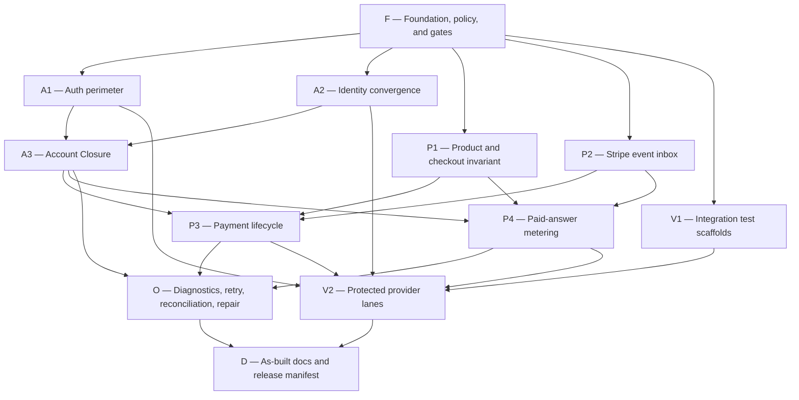

# Authentication and Trip Pass Production-Readiness Plan

Status: approved engineering implementation contract

This plan closes the repository's authentication and one-time Trip Pass readiness gaps. Completing
it does not authorize production checkout. Engineering hands off an exact, verified release
candidate with checkout mode `off`; named humans authorize and perform launch through
[`launch-trip-pass.md`](documentation/developer/how-to-guides/launch-trip-pass.md).

## Sources and Decisions

- [Production-readiness assessment](documentation/developer/explanation/auth-payments-production-readiness-assessment-2026-08-07.md)
- [Domain language](CONTEXT.md)
- [Architecture decisions](docs/adr/)
- [Environment reference](documentation/developer/reference/environment.md)
- [Release-candidate QA](documentation/developer/how-to-guides/run-release-candidate-qa.md)
- Installed Next.js guides under `node_modules/next/dist/docs/`; these must be read before changing
  authentication, Proxy, route, or App Router code, as required by `AGENTS.md`.
- Primary provider guidance:
  [Clerk middleware](https://clerk.com/docs/reference/nextjs/clerk-middleware),
  [Clerk session options](https://clerk.com/docs/guides/secure/session-options),
  [Stripe Checkout Sessions](https://docs.stripe.com/api/checkout/sessions/create), and
  [Stripe webhooks](https://docs.stripe.com/webhooks?lang=node).

The terms in `CONTEXT.md` are normative. The ADRs explain the hard-to-reverse tradeoffs behind
account identity, authority boundaries, retention, event acknowledgement, closure, commerce scope,
paid-answer metering, and payments completed after closure.

## Target Outcome

Ask Siargao has one fail-closed authentication perimeter and one production-capable commerce path:

- Clerk authenticates people. An immutable Clerk user ID identifies an Ask Siargao Account during
  its life; email is a nullable display attribute, never an ownership key.
- Stripe is authoritative for payment facts. Ask Siargao's PostgreSQL database is authoritative for
  Trip Pass access and Usage Meters.
- Direct Stripe Checkout is the only launch commerce surface. Legacy Trip Risk Audit checkout is
  impossible to enable in production, and Clerk Billing remains out of scope.
- A browser redirect never activates access. Only a verified, normalized Stripe event applied to
  local state can perform Trip Pass Activation.
- Account Closure immediately terminates access and writes, invalidates public sharing, and starts
  durable privacy cleanup without waiting for every downstream deletion.
- PostgreSQL owns durable invariants and production time comparisons. Redis owns shared short-lived
  quota, concurrency, and cost controls; paid traffic fails closed when those controls are
  unavailable, while verified webhooks remain independently processable.
- Operators are named, Clerk-authenticated, MFA-verified people. Diagnostics are read-only by
  default; every Repair Action is explicit, idempotent, and audited.

## Trip Pass Product Contract

The launch product is one versioned offer in one Trip Pass Product Family:

| Field | Launch contract |
| --- | --- |
| Price | USD 9.99, subject to the approved tax treatment |
| Term | Exactly 336 elapsed UTC hours from Trip Pass Activation |
| Allowance | One `chat_message` Usage Meter with 150 travel answers |
| Payment | One-time, immediate card-based Stripe Checkout |
| Stacking | Disabled across every product version and Stripe Price in the family |
| Extension | Disabled |

An amount, currency, duration, or answer-allowance change creates a new Trip Pass Product version.
The active Stripe Price ID, amount, currency, product version, and policy versions must agree at
checkout and event application. Live-refresh, heavy-recommendation, weather, and route counters are
not commercial allowances for new passes. A fixed paid daily-answer cap is removed; burst,
concurrency, abuse, and provider-budget safeguards remain operational controls.

An eligible pass is non-expired, non-exhausted, and not suspended or terminally revoked. An open
dispute or Refund Review does not create a second purchase opportunity. Expired, exhausted,
fully-refunded, or finally revoked passes do not block a new purchase. Operator goodwill grants obey
the same no-stacking rule and reference an approved zero-price support product version.

## Scope Boundaries

### In scope

- Explicit Clerk configuration modes and route classification.
- Monotonic Clerk identity synchronization and terminal Account Closure.
- Direct Stripe Checkout, event ingestion, order/pass/grant state, metering, refund, dispute,
  reconciliation, repair, and Paid After Closure handling.
- Privacy-minimized retention, purge, backup-restore protection, and legacy-data inventory.
- Real PostgreSQL and Redis integration gates, protected Clerk and Stripe lanes, Sentry operations,
  redacted diagnostics, and deterministic release evidence.
- Public and operator documentation matching the implemented behavior.

### Out of scope

- Enabling checkout, running a live charge, or making a production deployment.
- Selecting or provisioning external vendors, credentials, domains, scheduler cadence, tax policy,
  retention durations, or legal terms. Humans complete those items in the launch guide.
- Clerk Billing, subscriptions, stacking, pass extension, prorated refunds, additional commercial
  meters, delayed payment methods, or a dynamic feature-flag service.
- Rehabilitating legacy Trip Risk Audit checkout. Historical support/report access may remain when
  required by an approved retention policy.
- Retaining traveler content for analytics or model training after Account Closure.

## Engineering Completion Contract

Engineering is complete only when all of the following are true:

- Every runtime page and API route is explicitly classified. Unknown routes fail closed in runtime
  and fail the inventory test. Handler-level ownership checks remain in place.
- Production and protected staging require a complete explicit Clerk-enabled configuration. Only
  designated build, test, or untrusted-preview environments may explicitly disable Clerk.
- Identity synchronization is monotonic, nullable, session-safe, and non-resurrecting. Account
  Closure provides an immediate write barrier plus retryable cleanup.
- Checkout, activation, metering, refund, dispute, closure, and repair races converge under real
  PostgreSQL transactions and the Account/Product Family serialization boundary.
- Verified Stripe events are signature-checked, normalized, durably recorded, replay-safe,
  order-independent, and internally retryable without retaining raw payloads.
- Product data is erasable, commerce evidence is minimized, all retained data has an approved-policy
  version and purge deadline, and backup restoration reapplies privacy state before serving traffic.
- Diagnostics use live redacted data, reconciliation detects without mutating, Repair Actions require
  named Operator authority, and confirmed high-impact failures reach Sentry paging.
- Required local, CI, real-service, and provider test lanes pass for the exact release-candidate SHA.
- `qa:trip-pass-launch` emits a redacted deterministic JSON manifest as a protected CI artifact.
- `TRIP_PASS_CHECKOUT_MODE=off`, Trip Pass extension remains disabled, and the manifest distinguishes
  `engineeringReady` from `launchAuthorized`. Engineering completion cannot set launch authorization.

External approvals, production configuration, canary, live payment/refund proof, and final go/no-go
remain human launch blockers even after this contract passes.

## Dependency Graph



Workstreams may proceed in parallel only where the graph permits it. Database migrations are
additive and immutable per semantic slice; their numeric filenames are assigned in integration
order. Do not make independent branches guess or reuse migration numbers.

## Work Packages

### F — Foundation, policy, and gates

Dependencies: none.

Changes:

- Preserve unrelated existing work and use isolated worktrees for formatting or broad rewrites.
- Change Biome product scope to exclude imported skill bundles under `.agents/**` and
  `.github/skills/**`. Continue checking first-party application code, tests, scripts,
  configuration, `AGENTS.md`, `CONTEXT.md`, `docs/`, and `documentation/`.
- Keep skill-bundle validation separate from the product lint gate.
- Add explicit test commands for real PostgreSQL and real Redis. Pin service image versions in CI.
- Split release evidence into engineering readiness and human launch authorization.
- Define the redacted launch-manifest schema: exact commit SHA, migration set, configuration presence
  without values, product/policy versions, gate results, evidence links, and unresolved blockers.
- Make generated evidence a CI artifact rather than a committed mutable file.

Acceptance:

- `bun run lint` is non-mutating, passes on first-party scope, and still detects a seeded first-party
  violation.
- The existing 864-error/818-warning skill-bundle result no longer obscures product lint failures.
- Secret-free pull requests run PGlite, real PostgreSQL, and real Redis gates.
- Protected Clerk and Stripe jobs accept only trusted release-candidate commits and use dedicated
  test resources, never fork secrets, production credentials, or live mode.

### A1 — Explicit authentication perimeter

Dependencies: F.

Changes:

- Read the installed Next.js authentication, Proxy, route-handler, and App Router guides before
  editing these surfaces.
- Introduce explicit `CLERK_AUTH_MODE=enabled|disabled` server configuration. Reject missing,
  partial, or contradictory production configuration at startup/deployment validation.
- Require the publishable key, secret key, webhook signing secret, canonical origin, and exact
  authorized parties when enabled. Never infer mode from key presence.
- Permit only the production origin, one stable protected-staging origin, and localhost in
  non-production. Do not accept wildcard `*.vercel.app` origins. Untrusted/ephemeral previews are
  Clerk-disabled and receive no secrets.
- Make route policy the outer fail-closed perimeter for both pages and APIs. Public, protected, and
  externally verified webhook routes must all be explicit; unknown classifications fail runtime and
  inventory tests.
- Keep resource ownership in handlers. Middleware classification is defense in depth, not a
  replacement for owner authorization.
- Encode the approved Clerk launch policy in tests and docs: verified email, email one-time code and
  Google OAuth only, traveler MFA optional, Operator MFA mandatory, seven-day maximum sessions, and
  multi-session disabled.

Acceptance:

- A configuration matrix proves explicit disabled test mode, complete enabled mode, and failure for
  every partial or invalid production combination.
- HTTP tests prove protected pages/APIs deny unauthenticated requests, webhooks remain reachable for
  provider verification, public routes remain public, and newly added routes fail closed.
- Cross-account ownership tests remain green at the data boundary.

### A2 — Monotonic identity convergence

Dependencies: F.

Changes:

- Make local email, name, and image nullable webhook-managed display caches. Remove local email
  uniqueness and ownership semantics.
- Separate session presence from Clerk lifecycle application. A verified session may create only a
  minimal row containing Clerk user ID when absent and may update presence metadata; it never writes
  identity attributes, provider timestamps, or deletion state.
- Apply verified Clerk create/update events only when their provider timestamp is newer. Duplicate,
  stale, reversed, and post-deletion events are no-ops.
- Deny any session whose identifier matches a Closure Tombstone.
- Fetch a verified email transiently from Clerk only when a provider operation requires it. Do not
  copy it into new Trip Pass Orders or Passes.

Acceptance:

- Tests cover omitted session claims, minimal placeholder creation, duplicate/reversed lifecycle
  delivery, equal timestamps, stale updates, deletion races, and non-resurrection.
- Registering with the same email but a new Clerk user ID creates a distinct Ask Siargao Account and
  restores no data or Trip Pass.

### A3 — Account Closure and privacy state

Dependencies: A1 and A2.

Changes:

- Add an additive closure migration with a versioned keyed-hash Closure Tombstone, policy version,
  expiry, durable Closure Operation, attempts, sanitized errors, and next-attempt time.
- Provide a traveler-facing close-account action requiring Clerk verification no older than five
  minutes. Commit local phase one before requesting Clerk deletion; the verified Clerk deletion
  webhook is an idempotent confirmation and external-deletion fallback.
- In one serialized phase-one transaction: create the terminal tombstone and write barrier, create
  the Closure Operation, invalidate public shares, invalidate open usage reservations, and prevent
  in-flight content writes. Account access is denied from commit onward.
- Attempt to expire open Checkout Sessions without delaying the privacy barrier. If payment later
  succeeds, record Paid After Closure, create no pass, and start the retryable full-refund workflow.
- Retry Clerk deletion, Erasable Product Data deletion, active identity removal, and commerce
  minimization with bounded exponential backoff. Alert after the configured threshold but never
  abandon the obligation as dead-lettered work.
- Erase profile/preferences, chat/messages/ratings, saved trips/items, shared snapshots and token
  hashes, and legacy Trip Risk Audit inputs/runs/reports/diagnostics. Do not retain that content for
  analytics or model training.
- A voluntary closure terminates an existing pass without automatic proration. The confirmation UI
  states that remaining time and answers are lost; a separate support refund may still occur.

Acceptance:

- Account access, public shares, chat writes, paid usage, and pass activation are impossible after
  phase one even while cleanup or Clerk deletion is retrying.
- Tests cover closure versus sign-in, profile update, answer generation, checkout creation, webhook
  activation, pending payment, backup restore, duplicate closure, and worker retry.
- Tombstones contain no readable Clerk ID or email and purge only under the approved closure policy.

### P1 — Product boundary and checkout invariant

Dependencies: F.

Changes:

- Make direct Stripe Trip Pass Checkout the only production commerce path. Legacy audit checkout
  cannot be enabled by environment configuration; historical support/report access remains isolated.
- Replace the boolean rollout with server-only `TRIP_PASS_CHECKOUT_MODE=off|canary|on` and a
  reviewed Account-ID canary allowlist. Missing/invalid configuration resolves to `off` or fails
  deployment validation; it never opens checkout.
- Validate product version, Price ID, USD 9.99 base amount, currency, 336-hour duration, 150-answer
  meter, and current terms/refund/privacy/retention policy versions before creating a Session.
- Use immediate card-based payment methods only. Avoid deliberately creating/reusing Stripe
  Customers; pass verified email transiently for payment/receipt needs.
- Set Stripe Checkout Session expiry explicitly to 30 minutes. An Effective Pending Order remains a
  blocker until Stripe reports a terminal state, never merely because local time elapsed.
- Serialize checkout with a PostgreSQL transaction-scoped lock keyed by Account and Product Family,
  use database transaction time, and recheck the no-stacking invariant inside the transaction.
- Treat ambiguous Session-creation timeouts as unresolved: retain the reservation and retry the same
  Stripe idempotency key. Release only on definitive provider rejection or verified terminal state.
- Add an authenticated cancel action that expires the Session through Stripe and releases the Order
  only after terminal confirmation.
- Record presented policy versions and Stripe terms-consent evidence, without identity data or
  rendered policy bodies.

Acceptance:

- Parallel requests, product-version/Price changes, stale local clocks, ambiguous provider results,
  duplicate clicks, cancel redirects, and mixed active/exhausted/refunded states never produce two
  payable Sessions or destroy a possibly payable Order.
- An Exhausted Trip Pass permits immediate repurchase; an unexpired non-exhausted or dispute-
  suspended pass and an Effective Pending Order do not.
- Browser return shows only local Order state, polls idempotently, exposes an opaque support
  reference after a bounded wait, and never activates access or exposes Stripe identifiers.

### P2 — Durable Stripe event inbox

Dependencies: F.

Changes:

- Pin the Stripe API version and version the normalized local event schema.
- Enforce bounded request bodies and verify Stripe signatures before durable work. Verified webhook
  processing must not depend on Redis or IP rate-limit availability.
- Insert each unique verified event into a normalized ledger without raw payloads. Store only the
  event/object identifiers and payment facts required for deterministic application and retrieval.
- Acknowledge with success once durable receipt commits. Signature or persistence failure returns
  non-success. Missing prerequisites become Pending Stripe Events acknowledged to Stripe and retried
  internally.
- Retrieve targeted authoritative Stripe objects when normalized facts are insufficient. Unsupported
  event shapes remain blocked findings and alert operators; they are not silently ignored or marked
  applied.
- Apply event outcome, Order, Pass, Grant, and Usage Meter changes atomically. Duplicate or reversed
  delivery must converge to complete target state, not stop at an order-status shortcut.
- Retry pending application with bounded exponential backoff. Crossing an alert threshold changes
  urgency, never retryability.

Acceptance:

- Tests cover signature failure, oversized bodies, database failure, Redis outage, duplicate events,
  reverse order, prerequisite arrival during retry, targeted retrieval, unsupported schema version,
  crash boundaries, and incomplete prior application.
- A paid event cannot be acknowledged only in memory, and a persistently received event cannot be
  lost merely because immediate business application failed.

### P3 — Payment lifecycle and access transitions

Dependencies: A3, P1, and P2.

Changes:

- Activate from authoritative succeeded payment facts only. The 336-hour term starts at local Trip
  Pass Activation using PostgreSQL transaction time, so delayed webhooks do not shorten the term.
- Implement cumulative refund state: only successful refunds count; below captured amount remains
  Refund Review without changing access/meters; reaching captured amount terminally revokes access.
- Suspend on an open dispute. A merchant win restores only when that dispute is the sole suspension
  and only through original expiry. A lost dispute terminally revokes. Later/out-of-order events
  cannot restore a fully refunded or finally revoked pass.
- Invalidate open Paid Answer Reservations in the same serialized transition before full-refund or
  lost-dispute revocation commits. Best-effort cancel external work; never finalize after revocation.
- Handle Paid After Closure as a durable retryable idempotent full-refund workflow. Never create a
  pass or reopen the account. Page operators until Stripe confirms the refund.
- Keep normal verified-event application automatic. Reconciliation only detects; all mutations
  outside event application are Repair Actions.

Acceptance:

- State-machine tests cover full, cumulative partial, pending, failed, and cancelled refunds;
  dispute open/won/lost; refund/dispute overlap; expiry; reversed delivery; closure races; and retry
  after every transactional failure point.
- Public copy and account UI distinguish processing, active, exhausted, Refund Review, Dispute
  Suspension, expired, and terminally revoked states without promising automatic proration.

### P4 — Paid-answer metering

Dependencies: A3, P1, and P2.

Changes:

- Give new passes exactly one 150-unit `chat_message` Usage Meter. Retain only migration/read
  compatibility for legacy secondary meters.
- Preserve paid-first ordering: an eligible Trip Pass is used before authenticated free allowance;
  expired/exhausted passes do not suppress free access. Show the selected allowance clearly.
- Remove the fixed paid 30-successful-answers-per-day cap. Keep short-window starts, concurrency,
  confirmed-abuse, and provider/global budget circuits distinct from commercial allowance.
- Atomically create a Paid Answer Reservation before expensive generation. It temporarily reduces
  available allowance and is idempotent by account/pass/body/idempotency key.
- Finalize once when a complete, policy-compliant answer is durably stored, even if delivery is
  interrupted. Release on provider/internal failure, empty output, safety refusal, closure, or
  revocation. A stored answer is retrievable on retry.
- Recover stale reservations after a bounded lease using durable state; do not assume a process died
  merely from local clock drift.
- Paid usage fails closed when Redis shared controls or PostgreSQL metering are unavailable and
  consumes nothing. Provider-budget or service outages do not pause/extend the pass automatically;
  support may issue a separately audited refund or no-stacking goodwill grant.
- Expire per-request usage identifiers/hashes under an approved policy, leaving aggregate totals.

Acceptance:

- Real concurrent tests prove the meter never exceeds 150 finalized answers and never double-charges
  retries, multi-tool answers, reconnects, or duplicate settlement.
- Tests prove failure release, stale-reservation recovery, client disconnect, Redis outage, database
  outage, closure, refund, dispute, expiry, exhausted repurchase, paid-first behavior, and free
  fallback after pass ineligibility.

### O — Operations, reconciliation, and repair

Dependencies: A3, P3, and P4.

Changes:

- Replace sample diagnostics with live redacted views addressed by opaque local Finding IDs.
  Provider identifiers are transient lookup input and appear only when required for an audited
  Repair Action. Never render raw webhook bodies, email, prompts, cookies, IPs, precise locations,
  or raw provider payloads.
- Authorize Operators through a server-only allowlist of immutable Account IDs plus Clerk MFA.
  Shared `ADMIN_ACCESS_TOKEN` may remain temporarily for read-only local compatibility only and
  cannot authorize production mutation.
- Require MFA verification no older than five minutes for Repair Actions, goodwill grants, manual
  commerce transitions, and account recovery. Present a before/after preview.
- Make reconciliation compare local commerce with authoritative Stripe facts and record findings
  without mutation. Repair is a separate idempotent command recording Operator, finding,
  idempotency key, before/after state, reason, and time.
- Build idempotent closure, pending-event, refund, purge, and reconciliation workers callable from
  CLI or a thin authenticated adapter. Do not invent a scheduler provider; launch selects provider,
  cadence, retries, owner, and production proof.
- Send operational failures to Sentry with deny-by-default scrubbing. Keep PostHog analytics-only and
  structured logs for sanitized audit context.
- Page on one confirmed high-impact event: verified Stripe persistence/repeated-application failure,
  paid-without-pass, immediate closure-phase failure, Redis outage while checkout is `canary`/`on`,
  Paid After Closure refund failure, or live money/access reconciliation mismatch. Invalid
  signatures, abandonment, partial refunds, and transient analytics failures remain warning/ticket
  events unless an attack or wider incident is confirmed.

Acceptance:

- Reconciliation dry-run cannot mutate under any flag combination.
- Repair requires named Operator authority, fresh MFA, explicit confirmation, and idempotency.
- Synthetic Sentry tests prove delivery and scrubbing; PostHog failure cannot alter commerce/access.
- Worker crash/retry tests prove obligations remain visible and retryable after alert thresholds.

### V1 — Secret-free integration scaffolds

Dependencies: F; begin early and extend with every work package.

Changes:

- Keep focused Bun/PGlite tests beside source for fast feedback.
- Add a pinned real-PostgreSQL harness for migrations, transaction rollback, advisory locking,
  database-time boundaries, concurrent checkout, event uniqueness, closure, refunds, and metering.
- Add a pinned real-Redis harness for atomic rolling windows, idempotency, concurrency leases,
  shared-instance behavior, outage fail-closed behavior, and verified-webhook independence.
- Make both secret-free harnesses required pull-request checks.

Acceptance:

- A regression that passes PGlite but violates PostgreSQL concurrency or locking fails the required
  PostgreSQL lane.
- A process-local or unavailable Redis fallback cannot pass the production-mode Redis lane.

### V2 — Protected provider and release-candidate gates

Dependencies: A1, A2, P3, P4, and V1.

Changes:

- Add an isolated Clerk test-instance Playwright lane covering email-code and Google flows, verified
  email, session persistence/expiry policy, sign-out, single-session behavior, protected routes,
  ownership denial, account management, step-up closure, webhook convergence, and deletion.
- Add a Stripe test-mode lane covering card Checkout, 30-minute expiry, return-before-event,
  activation, duplicate/reversed delivery, ambiguity retry, cancellation, full/cumulative-partial
  refund, disputes, closure races, Paid After Closure, reconciliation, and repair authorization.
- Run lanes only on an exact trusted release-candidate SHA with dedicated staging/test resources.
  Never expose secrets to forks, use production users, or run live-mode transactions.
- Make tests assert semantic ordering where required: authoritative provider lookup completes before
  dependent application starts; broad green gates do not replace this evidence.

Acceptance:

- Protected results identify the exact commit and migration set and remain required for release
  candidacy.
- Any code or migration change invalidates affected evidence and requires rerun before handoff.

### D — As-built documentation and release evidence

Dependencies: O and V2.

Changes:

- Update `.env.example` and the environment reference for explicit Clerk mode, exact origins,
  checkout mode/allowlist, Stripe API/schema versions, retention policies, tombstone HMAC rotation,
  Redis, Sentry, Operator authorization, and worker adapters. Use placeholders only.
- Replace stale Clerk docs with as-built architecture and runbooks for sign-in methods, session/MFA,
  webhooks, identity convergence, closure, key rotation, monitoring, and rollback.
- Update Trip Pass public copy, policy links, account/checkout states, reconciliation and repair docs,
  scripts reference, and release-candidate QA to the implemented behavior.
- Update the launch-proof command to emit the redacted deterministic manifest as a CI artifact.
- Keep the reusable human procedure in `launch-trip-pass.md`; each launch uses a dedicated GitHub
  issue as the approval system of record.

Acceptance:

- Documentation contains no stale boolean checkout, shared-token repair, raw-payload retention,
  secondary commercial meters, automatic partial-refund revocation, or browser activation claims.
- A reviewer can trace every manifest field to a command, protected run, policy version, or explicit
  unresolved human blocker.

## Migration Slices

Each semantic slice receives one additive immutable migration, integrated in dependency order:

1. Nullable identity caches, closure tombstone/operation, and write-barrier state.
2. Product-family checkout reservation/invariant and policy-consent support.
3. Versioned Stripe event inbox and expanded Order lifecycle.
4. Refund, dispute, Paid After Closure, and retry-workflow state.
5. Paid Answer Reservation and retention-expiry support.

Use expand-first deployment. Application code must tolerate old/new rows during rolling deploys.
Destructive constraint removal, legacy cleanup, and physical purges occur only in separately reviewed
post-launch-compatible migrations or bounded workers. Rollback never reverses privacy, payment, or
entitlement records; additive schema remains and code rolls back to a verified compatible release.

## Required Verification

Run targeted tests while developing each package. Before an engineering-readiness handoff, run from
a clean isolated worktree:

```sh
bun run format
git diff --check
bun run lint
bun run typecheck --incremental false
bun test
bun run db:migrate:test
bun run db:seed:test
bun run build
bun run test:e2e
bun run test:integration:postgres
bun run test:integration:redis
bun run verify:ci
```

Then run protected release-candidate lanes on the exact proposed SHA:

```sh
bun run test:e2e:clerk
bun run test:smoke:trip-pass-stripe
bun run qa:trip-pass-launch -- --write
```

The implementation must add any command above that does not yet exist. Formatting is the only
write-mode quality command and runs only after reviewing/preserving unrelated changes. A failing
required gate is fixed or remains an explicit blocker; it is never weakened, skipped, or converted to
advisory status. React Doctor may remain advisory unless repository policy promotes it separately.

## Risk Register

| Risk | Required control |
| --- | --- |
| Paid customer receives no pass | Redis-independent durable webhook receipt, pending retry, reconciliation, paging |
| Duplicate charges without value | Product-family database serialization, 30-minute provider-confirmed pending state, idempotency |
| Stale identity resurrects closure | Monotonic webhooks, keyed-hash tombstone, phase-one write barrier |
| Refund/dispute corrupts access | Atomic cumulative-refund/dispute state machine and terminal precedence |
| Meter overspends under concurrency | PostgreSQL reservation/finalization with idempotent durable outcomes |
| Closure races with payment | Session expiry attempt plus Paid After Closure automatic refund workflow |
| Retained data exceeds purpose | Versioned policies, explicit expiry, bounded purge, restore-time reapplication |
| Operator leaks or mutates data | Opaque findings, server allowlist, MFA, read-only reconciliation, audited repair |
| Evidence belongs to different code | Exact SHA/migration manifest and protected reruns after every relevant change |
| Rollback destroys state | Expand-first migrations, checkout `off`, forward repair, compatible verified release |

## Handoff to Human Launch

When every engineering criterion passes:

1. Leave `TRIP_PASS_CHECKOUT_MODE=off` and extension disabled.
2. Identify the exact reviewed commit SHA and migration set.
3. Publish the redacted engineering-readiness manifest from protected CI.
4. Confirm no unresolved code, security, privacy-implementation, or required-gate blocker remains.
5. Open no launch flag automatically. Hand the release candidate to the named humans using
   [`launch-trip-pass.md`](documentation/developer/how-to-guides/launch-trip-pass.md).

GitHub issues and pull requests track execution and evidence. `PLAN.md` remains the stable contract;
it is not a transient progress log. Any scope or product-contract change returns here for explicit
review before implementation continues.
