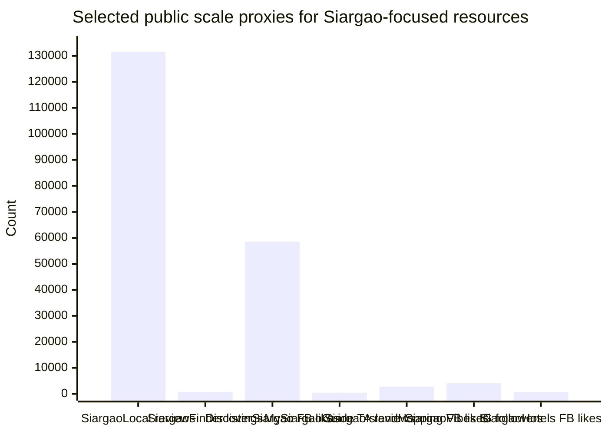

# Siargao Island Travel Resources

## Executive summary

I found **roughly eleven active, discoverable websites that are wholly or primarily about Siargao and materially useful to travellers**, plus a small number of adjacent Siargao-only platforms that are more about local living or classifieds than travel planning. Of those eleven, only **about five to six are strong enough to recommend heavily** for a typical English-speaking traveller in 2026: **SiargaoLocal**, **Siargao Finder**, **Siargao Island Hopping**, **Siargao Vibes**, and **SiargaoHotels.ph**. The rest are still useful in narrow ways, but several show signs of weak maintenance, stale policy information, thin disclosure, or templated SEO-style content. citeturn10view4turn38view0turn10view3turn14view1turn10view2turn34view0turn24view0turn37view0turn10view1turn14view2turn34view1

The biggest structural gap is **the absence of a strong, standalone official Siargao tourist portal**. Official information exists, but it is fragmented across the **DOT ecosystem**, the **Provincial Government of Surigao del Norte**, municipal pages, and social channels. The DOT did open a **satellite office in General Luna in February 2024**, which improves institutional presence on-island, but that has not yet translated into a clearly dominant, single-source official Siargao website for visitors. citeturn27view0turn28search29turn28search2turn28search6

On AI, I did **not** find any Siargao-focused site that explicitly discloses OpenAI, Gemini, Claude, an AI assistant, or AI-generated imagery in its public-facing pages reviewed here. However, a few sites show **patterns consistent with programmatic or AI-assisted SEO copy**: unusually generic destination text, repetitive keyword stuffing, very high-volume topical publishing, or templated FAQ blocks. The strongest examples are **SiargaoIslandTours.com**, **SiargaoHotels.ph**, and, to a lesser extent, **Siargao.PH**. That is not proof of AI use, but it is a meaningful signal for travellers assessing trust. citeturn24view0turn10view2turn37view0

For general, non-Siargao-specific coverage, the most useful resources are **Tripadvisor** for reviews/forums, **Booking.com** and **Agoda** for accommodation inventory, **Klook** for activity booking, and **official government sources** for accreditation, transport, and policy context. citeturn12search18turn13search0turn12search14turn12search2turn25search8turn12search15turn21search1turn28search2turn21search24

## Scope and method

This review focuses on websites that are either **Siargao-only** or have a **Siargao section so central that it is effectively a primary proposition**. I prioritised English-language pages, official/public-sector information where available, original travel guides, direct booking utilities, and visible evidence of user traction. Where public Similarweb/Ahrefs/SEMrush-style traffic estimates were not accessible in public snippets, I marked traffic as **unspecified** and relied on other visible indicators such as listing counts, review counts, social-following snippets, third-party marketplace ratings, and evidence of continued publishing. citeturn10view4turn38view0turn35view0turn29search8turn29search9turn29search3turn18search2turn18search11

A practical caveat matters here: Siargao’s web ecosystem is unusually fragmented. Some of the most trusted traveller information still lives in **Facebook, Instagram, TripAdvisor, booking platforms, and operator pages**, rather than on polished standalone editorial sites. A good example is **My Siargao Guide**, which appears to be a major, trusted Siargao operator with **460 TripAdvisor reviews**, about **10,025 Facebook likes**, and **14.5K Instagram followers**, but whose web footprint is led more by review and social platforms than by a clearly dominant owned website in search results. citeturn29search9turn29search13turn29search1

## Siargao-focused websites

The table below lists the most relevant Siargao-focused sites I found.

| Site | URL | Owner or organisation | Founding date | Primary content types | Evidence of AI use | Public success indicators | Credibility and usefulness |
|---|---|---|---|---|---|---|---|
| Siargao Local | `https://www.siargaolocal.com/` | Operator not clearly named; contact email is `chris@siargaolocal.com` | **Approx. Mar 2026** based on earliest indexed pages and March 2026 terms update | Directory, reviews, area guides, blog, business listings | No explicit AI disclosure. Transparency page says listing data comes from **public sources, Google Maps, customer reviews, and personal visits**; templated area/category pages exist but are not obviously AI-written. | **946+ listings**, **131,598+ reviews**, **16 locations**, **47 categories**; site claims “**thousands of visitors search this site every month**.” | **High**. Best balance of depth, recency, transparency, and local practicality. Strong for restaurants, surf, nightlife, and location-based browsing. citeturn10view4turn11search4turn30search2 |
| Siargao Finder | `https://www.siargaofinder.com/` | Independent directory project | **2026-03-11** WHOIS registration; site describes itself as a hobby/independent project | Directory, practical listings, business discovery, limited blog | No explicit AI disclosure. About page stresses manual verification, free listings, and no paid ranking. | **752 listings**, **9 municipalities covered**; newly launched, so public traffic unspecified. | **High-medium**. Very transparent and promising, but new. Good for utilities, clinics, transport, and businesses beyond the usual tourist circuit. citeturn14view0turn38view0turn19search6 |
| Siargao Island Hopping | `https://siargaoislandhopping.com/` | **ADAII Travel and Tours**; managing directors **Nomer Alcazar** and **Arlene II Alcazar** | **Since 2018** | Direct tour booking, tour-blog content, Messenger/WhatsApp contact | No explicit AI disclosure. Messenger/WhatsApp chat is visible, but that is not evidence of generative AI. | Facebook snippet shows **2,739 likes**, **168 talking about this**, **2,013 were here**; GetYourGuide supplier page shows one activity at **4.1/5 (30 reviews)**. | **High** for booking island-hopping and packaged tours; **not** a broad destination guide. Strong third-party validation for a local operator. citeturn10view3turn35view0turn29search3turn32search14 |
| Siargao Vibes | `https://siargaovibes.com/` | Owner not clearly named; contact `info@siargaovibes.com` | **At least 2025** | Local guide, nightlife/events, activities, bookings, blog | No explicit AI disclosure. Public pages show listings, events, and commerce flows; “live chat” appears on related Siargao Living, not on this site. | Instagram snippet shows **4.1K+ followers**; blog and event listings are current in 2026 and the site sells/books some activities. | **High-medium**. Especially useful for **what is happening now**: nightlife, events, and contemporary itinerary planning. Editorial standards are lighter than Siargao Local’s. citeturn14view1turn18search2turn30search1turn30search7turn32search8 |
| SiargaoHotels.ph | `https://siargaohotels.ph/` | **Zayne Xander Booking Services** | **At least late 2018** based on oldest indexed pages | Hotel/tour/rental booking, blog, FAQs | No explicit AI disclosure. Some FAQ blocks are heavily keyword-stuffed and read like programmatic SEO content, which is consistent with possible AI assistance but not proof. | Facebook page snippet shows about **650–660 likes**; indexed hotel content dates back **~7.6 years**. | **Medium-high**. Commercial and sales-led, but useful for travellers who want accommodation, tours, rentals, and one-stop booking in a single place. citeturn10view2turn18search11turn18search3turn8search11turn18search21 |
| Siargao Island Tour | `https://www.siargaoislandtour.com/` | Brand appears to be **Siargao Island Getaway**; operator name not clearly disclosed on-site | **Active by 2018** | Tour packages, tourist-spot pages, reservations, transfers | No explicit AI disclosure. Copy is generic and sparse, but not as machine-like as the weakest sites. | External presence includes Cybo snippet showing **4.7/5 (13)** and appearances on Wanderlog/GetYourGuide-linked pages. | **Medium**. Useful for direct package shopping, but weaker on company disclosure and editorial depth than Siargao Island Hopping. citeturn9view3turn36search1turn36search14turn36search21 |
| Siargao.PH | `https://www.siargao.ph/` | Owner not specified | **Approx. Feb 2025** based on archive | Blog, culture/history pieces, local living, practical guides | No explicit AI disclosure. The archive shows **196 posts in 2025** and many pieces use generic “Reporter/Admin” style bylines; this is consistent with scaled or AI-assisted publishing, but not conclusive. | Very high post volume in 2025; public traffic/review/social indicators unspecified. | **Medium-low**. Broad topical coverage and useful for local culture context, but editorial provenance is thin and scaled publishing lowers trust for high-stakes practical details. citeturn10view0turn37view0 |
| Siargao Islands | `https://www.siargaoislands.com/` | Owner not specified | **Unspecified**; actively publishing in 2026 | Blog/news, travel tips, booking sections, local directory, some ecommerce | No explicit AI disclosure. A “Siargao Web Authors Guild” recruitment post suggests an attempt to scale content production. | Frequent 2026 publishing; recurrent search visibility for Siargao terms. | **Medium-low**. Broad and active, but mixes travel, local government-style updates, directories, and lightweight articles with limited editorial disclosure. citeturn10view1turn9view4turn8search15 |
| Siargao Islands .NET | `https://www.siargaoislands.net/` | Owner not specified; site says it is **powered by SiargaoIslands.com** and supported by WowSurigao.com | **At least 2021**, likely older | Legacy portal: travel tips, hotels, dining, flights, contact, municipal info | No explicit AI disclosure. | Legacy visibility in search and long-running content archive; no strong current audience metric surfaced. | **Low-medium**. Potentially useful as a legacy reference or for obscure local information, but too dated and mixed for primary planning. citeturn14view2turn22search4turn23search16 |
| Discover Siargao | `https://www.discoversiargao.com/` | Discover Siargao; supported by **Surigaoislands.com**, hosted by **MindedHeart**, design by **JML** | **At least 2019** | Accommodation, real estate, schedules, travel guide, forum, directory, events | No explicit AI disclosure. Heavy template/network feel; not enough to prove AI. | Facebook page snippet shows **58,533 likes** and **604 talking about this**. | **Medium-low**. It has breadth, but travel guidance is mixed with real estate and classifieds. The biggest red flag is stale “travel requirements” content about RT-PCR/antigen-era rules still being surfaced prominently. citeturn34view0turn29search8turn30search0 |
| Suroy Siargao | `https://suroysiargao.com/` | Suroy Travel & Tours | **At least 2018** via Facebook evidence | Direct booking/contact microsite | No explicit AI disclosure. | Facebook snippet shows **3,035 likes**; Instagram snippet shows **68 followers**. | **Low** for research, **medium-low** as a simple operator landing page. Too thin to rely on as a planning resource. citeturn34view1turn31search6turn31search2turn31search5 |
| Siargao Island Tours | `https://www.siargaoislandtours.com/` | Operator not clearly disclosed; linked to Discover Siargao / Suroy / Surigao network | Unspecified | Single-page tour landing page | **Strongest suspicion of machine-assisted or low-quality template text**. The copy is generic, contains odd phrasing about “remote areas of the Earth’s surface,” mentions faxing payment information, and includes misspellings such as “Corrigedor” and “Caub Sugba Lagoon.” | No strong public validation found. | **Low**. This is the weakest traveller resource in the set and should not be trusted for consequential planning without independent cross-checking. citeturn24view0turn34view1 |

Two read-across points matter more than any single row. First, **SiargaoLocal** and **Siargao Finder** are the best examples of the new Siargao directory model: local-first discovery, many listings, and some transparency about how data is gathered and maintained. Second, the older networked sites — especially **Discover Siargao**, **Suroy Siargao**, **Siargao Islands .NET**, and **Siargao Island Tours** — are still visible in search, but they are materially weaker on freshness, disclosure, and editorial reliability. citeturn10view4turn38view0turn34view0turn34view1turn14view2turn24view0

A notable market nuance is that **some of the strongest Siargao traveller brands are not website-led**. **My Siargao Guide** is a good example: it appears highly trusted through TripAdvisor, Facebook, and Instagram, even though it does not currently dominate search via a standalone website in the way SiargaoLocal or Siargao Island Hopping do. For travellers, that means a “websites only” strategy will miss some of the island’s strongest operators. citeturn29search9turn29search13turn29search1

## Major general resources with strong Siargao coverage

The most useful non-Siargao-specific resources are as follows.

| Resource | URL | Why it matters for Siargao | Credibility and usefulness |
|---|---|---|---|
| Surigao del Norte provincial government | `https://surigaodelnorte.gov.ph/` | Provincial pages surface **Siargao festivals**, town-level pages such as **General Luna** and **Burgos**, and visibly link to **DOT-accredited accommodation** resources. | **High** for official context, accreditation, municipal background, and some festival/historical information. Less strong for polished trip-planning UX, and some subpages can be hard to access directly. citeturn28search29turn28search2turn28search6turn28search5turn13search11 |
| Department of Tourism ecosystem | `https://www.tourism.gov.ph/` | Official national tourism platform; the DOT also opened a **satellite office in General Luna** in 2024. | **High** as an official signal source, but not yet the best deep-dive Siargao planner. Strongest when paired with provincial pages and operator-level sites. citeturn21search1turn27view0 |
| 2GO Travel | `https://2go.com.ph/travel/explore/ports-and-destinations/siargao/` | Official route and sailing information for the **Manila–Siargao** service and Siargao schedule pages. | **High** for ferry planning and transport confirmation; specialised rather than broad. citeturn21search7turn21search24turn21search17 |
| Tripadvisor | `https://www.tripadvisor.com/` | Strong Siargao hotel pages, tours/excursions listings, and an active travel forum. | **High** for reviews, ranking, and traveller sentiment; variable on recency and crowd bias. Essential as a cross-checking layer. citeturn8search18turn12search18turn13search0turn29search9 |
| Booking.com | `https://www.booking.com/region/ph/siargao-island.html` | Deep accommodation inventory for the island. | **High** for hotel comparison and guest reviews; weaker on activity and local-scene nuance. citeturn12search14 |
| Agoda | `https://www.agoda.com/city/siargao-island-ph.html` | Large accommodation inventory and a Siargao guide layer. | **High-medium**. Better for inventory breadth than for original destination reporting. citeturn12search2turn25search8 |
| Klook | `https://www.klook.com/en-PH/destination/p50338169-siargao-island/5-tour/` | Bookable tours and activities in Siargao. | **High-medium** for activity booking and quick price comparison; not a substitute for deep local research. citeturn12search15turn23search22 |

In practice, the strongest workflow for a traveller is not to choose one of these, but to combine them. A robust planning stack looks like this: **official/provincial pages for rules and accreditation**, **a strong local Siargao site for local texture**, and **Tripadvisor/Booking/Klook** for reviews, inventory, and comparison shopping. citeturn28search2turn27view0turn10view4turn38view0turn12search18turn12search14turn12search15

## AI-use findings and how to detect AI when disclosure is unclear

In the public-facing pages reviewed here, I found **no explicit statement** such as “written with AI”, “AI-generated images”, “powered by OpenAI/Gemini/Claude”, or “AI concierge” on the main Siargao-focused sites. What I *did* find was a spectrum:

**Clear non-AI signals or neutral signals.** Some sites show ordinary commerce/chat features rather than AI. **Siargao Island Hopping** prominently uses **Messenger, Instagram, and WhatsApp** for contact; that is customer-service tooling, not evidence of generative AI. **Siargao Finder** openly describes itself as a small independent directory built from public business information, submissions, and manual verification. **SiargaoLocal** is transparent that it aggregates from public sources, reviews, and personal visits. citeturn10view3turn38view0turn11search4

**Possible AI-assisted or programmatic-content signals.** The strongest examples are the sites where copy quality diverges sharply from real local specificity. **SiargaoIslandTours.com** reads like generic travel boilerplate: it speaks about reaching “remote areas of the Earth’s surface”, recommends confirming via “mailing or faxing” payment information, and contains multiple spelling errors in destination names. That constellation is consistent with machine assistance or low-quality templating. **SiargaoHotels.ph** has a different pattern: the content is more coherent, but many FAQ answers repeat exact keyword strings such as “Cloud 9 Siargao hotels”, “General Luna Siargao hotels”, and “affordable hotels in Siargao” in a way that strongly suggests programmatic SEO production. **Siargao.PH** has a third pattern: very high content volume in a short period, generic bylines, and broad coverage across culture, business, startups, and travel. None of that proves AI, but it raises the probability of AI-assisted scaling. citeturn24view0turn10view2turn37view0

When disclosure is unclear, the best detection method for a traveller or analyst is practical rather than forensic. Check four things. First, look for **public disclosures** in About, Terms, Privacy, or job-style pages. Second, inspect whether the site uses **chat widgets or recommendation engines** that are described as assistants rather than mere contact forms. Third, scan the copy for **repetitive keyword scaffolding, thin local detail, odd generalisations, and publish-volume spikes**. Fourth, compare the site’s practical claims against official or independent sources: stale policy blocks like Discover Siargao’s prominent RT-PCR/antigen-era travel-requirements module are often a stronger warning sign than AI itself, because they tell you the content pipeline is not being governed tightly enough. citeturn34view0turn10view3turn10view2turn37view0

For a deeper technical audit beyond this report, I would inspect page source and network requests for products such as **Chatbase, Tidio AI, Intercom Fin, Crisp AI, OpenAI API endpoints, Gemini references, or synthetic image/CDN patterns**, then compare that against on-page disclosures. But from the public-facing evidence available here, the main conclusion is simple: **explicit AI use is mostly undisclosed, while possible AI-assisted SEO publishing is present on a minority of sites**. citeturn24view0turn10view2turn37view0

## Ranked recommendations

For most travellers, I would rank the **top five Siargao-focused resources** like this:

1. **SiargaoLocal** — the best all-round local guide because it combines scale, recency, transparency, and practical browsing. It is especially strong for on-island decisions once you already know you are going. citeturn10view4turn11search4  
2. **Siargao Finder** — the best emerging practical directory, especially for locating services that tourists often need but glossy guides ignore. It loses first place only because it is so new. citeturn14view0turn38view0turn19search6  
3. **Siargao Island Hopping** — the strongest Siargao-specific direct booking resource in the set, with clear 2018 longevity and third-party trust signals. citeturn10view3turn35view0turn29search3  
4. **Siargao Vibes** — the best for nightlife, event rhythm, and a more contemporary “what’s on this week” view of the island. citeturn14view1turn30search7turn18search2  
5. **SiargaoHotels.ph** — commercially useful for travellers who prefer one-stop accommodation/tour/rental planning, though I would read the editorial material with more caution than its booking functions. citeturn10view2turn18search21  

I would rank the **top five general resources for Siargao travel** like this:

1. **Tripadvisor** — still the best general cross-checking layer for tours, hotels, and peer reviews. citeturn12search18turn13search0turn29search9  
2. **Surigao del Norte provincial government** — the best institutional resource for Siargao-specific official context, festivals, municipal pages, and accreditation links. citeturn28search29turn28search2turn28search6  
3. **Booking.com** — best for wide accommodation inventory and dependable review volume. citeturn12search14  
4. **Klook** — best for fast activity comparison and bookable tours. citeturn12search15turn23search22  
5. **2GO Travel** — best official route source for ferry travellers and directly relevant now that Manila–Siargao sailings exist. citeturn21search7turn21search24  

If I were planning my own trip, I would use **SiargaoLocal + Tripadvisor + Booking/Klook + the provincial/2GO pages** as the minimum stack, then check **Siargao Vibes** shortly before arrival for nightlife and event timing. citeturn10view4turn12search18turn12search14turn12search15turn28search29turn21search24turn14view1

## Market analysis

A reasonable web-search-based estimate is that **there are about 10–12 active Siargao-only web properties that travellers can realistically discover today**, but only **half of them are strong traveller products**. The ecosystem splits into four business models: **local directories** such as SiargaoLocal and Siargao Finder; **operator-led booking sites** such as Siargao Island Hopping and Siargao Island Tour; **content/SEO portals** such as Siargao.PH and SiargaoIslands.com; and **hybrid commerce portals** such as Discover Siargao, which blend travel with real estate/classifieds. Adjacent platforms such as **Siargao Living**, established in 2025 as a classifieds/community site, show that the island also has a small but growing “local living” web layer that overlaps with travel but is not primarily a traveller resource. citeturn10view4turn38view0turn10view3turn9view3turn37view0turn10view1turn34view0turn38view1

The market’s biggest gap is **official consolidation**. The public sector has real information assets — municipal pages, festivals, accreditation links, transport notices, and a DOT satellite office — but no clearly superior official Siargao destination portal. That leaves a vacuum that commercial sites are filling unevenly. The second big gap is **fresh, trusted logistics intelligence**: flights, ferries, closures, environmental fees, surf-event timing, and operator accreditation are still too fragmented. The third gap is **traveller-segment depth**. There is some content for digital nomads, nightlife seekers, and broad itineraries, but relatively little strong, transparent guidance for families, accessibility, sustainability, or long-stay practicalities at an editorial standard comparable to the best global destination resources. citeturn27view0turn28search2turn28search6turn21search24turn30search11turn37view0

That produces a clear opportunity. The winning next-generation Siargao resource would probably be a **mobile-first, officially adjacent but editorially independent local platform** that combines verified listings, live transport/event feeds, transparent affiliate/booking economics, and clearly disclosed AI-assisted search or trip-planning features grounded in official and local data. Right now, no site I reviewed convincingly owns that position. citeturn10view4turn38view0turn27view0turn28search29

The chart below uses **publicly visible reach proxies**, not like-for-like traffic, because direct public traffic figures were unavailable for most micro-sites. Even so, it shows how uneven the current Siargao-only landscape is.

Those proxies come from on-site listing/review counts and public social/review snippets: **SiargaoLocal** shows **131,598+ reviews**; **Siargao Finder** shows **752 listings**; **Discover Siargao** shows **58,533 Facebook likes**; **My Siargao Guide** shows **460 TripAdvisor reviews**; **Siargao Island Hopping** shows **2,739 Facebook likes**; **Siargao Vibes** shows **4.1K+ Instagram followers**; and **SiargaoHotels.ph** shows about **650–660 Facebook likes**. Put differently, the island has a few resources with visible traction, but most of the sector still operates at small scale and with uneven product maturity. citeturn10view4turn14view0turn29search8turn29search9turn29search3turn18search2turn18search11turn18search3