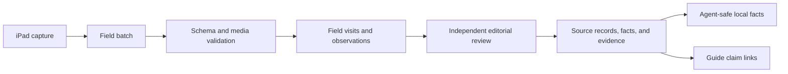

# Field Research Data Model

This reference proposes the PostgreSQL contract for first-hand Siargao field research. It is a
design document, not an implemented migration. The model keeps raw field capture separate from the
governed `facts` and `evidence` tables that can feed chat answers and public guide claims.

The first campaign is expected to begin from a Del Carmen base on 2026-08-22. A planned move is not
itself evidence of residence or local expertise. Record that relationship publicly only after it is
true and its wording has been reviewed.

## Design Rules

- A field note is an observation, not automatically a fact.
- Store one atomic observation per row. Do not bury several claims in free text.
- Preserve the capture time, place, method, conditions, observer, and supporting asset.
- Separate direct observation, instrument measurement, posted notice, and third-party statement.
- Keep precise coordinates, contact details, faces, voices, and consent records private by default.
- Admit reviewed observations into the existing fact graph instead of exposing capture tables to the
  chat agent.
- Make corrections additive. Supersede records; do not silently rewrite field history.
- Use `timestamptz` for instants and retain the local IANA time zone used during capture.
- Store money as integer minor units plus ISO 4217 currency.
- Store media outside PostgreSQL. Keep an immutable URI, hash, metadata, and rights state in the
  database.
- Use `jsonb` only for versioned, variable payloads. Common filter, join, and governance fields remain
  typed columns.

## Relationship To The Existing Schema

The repository already has the publication side of the lifecycle:

- `areas`, `routes`, and `entities` identify normalized subjects.
- `providers`, `source_profiles`, and `source_permissions` govern allowed use.
- `raw_snapshots` and `source_records` preserve provider lineage.
- `facts`, `evidence`, `reviews`, confidence scores, and conflicts govern claims.
- `public_evidence_bundles`, `public_pages`, and `public_page_facts` project approved material.

Field tables should sit before those tables in the lifecycle:



No chat tool or public route should query the capture tables directly.

## Source Registry Setup

Before the first admission, create a governed source identity. Suggested stable values are:

| Field | Proposed value | Notes |
| --- | --- | --- |
| Provider ID | `provider_field_research` | A product-maintained first-hand research program. |
| Provider type | `user_submitted_evidence` | Reuse the current provider enum until a dedicated type is approved. |
| Source profile ID | `source_firsthand_alex_metelli` | Identifies the method and accountable observer. |
| Source type | `local_verified` | Already supported by the fact graph. |
| Access method | `first_hand_fieldwork` | Add to the applicable database constraint if it is constrained. |
| Default allowed use | `internal_only` | Public rights are granted per reviewed observation, never by assumption. |
| Raw storage | allowed | Subject to the media and consent retention policy. |
| Authority | fact-specific | Direct presence does not make an observer authoritative for every claim. |

Create explicit permissions for internal review, LLM retrieval, article support, quotation, and public
republication. A single `public_republish` flag is not sufficient to express interview consent,
precise-location sensitivity, or asset licensing during capture.

## Proposed Tables

The names below follow the repository's plural snake-case table convention and text identifiers.

### `fieldwork_methodologies`

Versions the capture protocol so a future reviewer can interpret an old record correctly.

| Column | Type | Required | Meaning |
| --- | --- | --- | --- |
| `id` | `text` | yes | Stable ID such as `field_method_2026_01`. |
| `version` | `integer` | yes | Monotonically increasing protocol version. |
| `title` | `text` | yes | Human-readable protocol name. |
| `schema_version` | `text` | yes | Batch and observation payload schema version. |
| `document_path` | `text` | yes | Repository path for the exact playbook. |
| `effective_from` | `timestamptz` | yes | Start of validity. |
| `retired_at` | `timestamptz` | no | End of validity. |
| `created_at` | `timestamptz` | yes | Audit timestamp. |

Constraints:

- Unique `(version)` and `(schema_version)`.
- `retired_at` is null or later than `effective_from`.

### `fieldwork_campaigns`

Groups visits around a bounded research objective.

| Column | Type | Required | Meaning |
| --- | --- | --- | --- |
| `id` | `text` | yes | Stable campaign ID. |
| `slug` | `text` | yes | Human-readable unique key. |
| `title` | `text` | yes | Campaign title. |
| `methodology_id` | `text` FK | yes | Exact capture protocol. |
| `base_area_id` | `text` FK | yes | Operational base, initially Del Carmen. |
| `starts_on` | `date` | yes | Planned or actual start date. |
| `ends_on` | `date` | no | Campaign end, if bounded. |
| `status` | `text` | yes | `planned`, `active`, `paused`, `completed`, or `cancelled`. |
| `objectives` | `jsonb` | yes | Versioned array of guide and fact coverage objectives. |
| `created_by` | `text` | yes | Internal actor key, not a public byline. |
| `created_at` | `timestamptz` | yes | Audit timestamp. |
| `updated_at` | `timestamptz` | yes | Audit timestamp. |

Constraints and indexes:

- Unique `slug`.
- `ends_on` is null or not earlier than `starts_on`.
- Index `(status, starts_on)` and `(base_area_id, starts_on desc)`.

### `field_batches`

Represents one immutable upload from the iPad workflow. It is the deduplication and audit boundary for
bulk ingestion.

| Column | Type | Required | Meaning |
| --- | --- | --- | --- |
| `id` | `text` | yes | Server-generated batch ID. |
| `campaign_id` | `text` FK | yes | Owning campaign. |
| `client_batch_id` | `text` | yes | UUID generated on the iPad. |
| `schema_version` | `text` | yes | Bundle schema version. |
| `manifest_sha256` | `text` | yes | Hash of canonical manifest bytes. |
| `source_device_id_hash` | `text` | yes | Rotatable pseudonymous device identifier. |
| `captured_record_count` | `integer` | yes | Count declared by the manifest. |
| `received_at` | `timestamptz` | yes | Server receipt time. |
| `status` | `text` | yes | `received`, `validating`, `rejected`, `staged`, `reviewed`, or `committed`. |
| `validation_summary` | `jsonb` | yes | Counts and machine-readable error codes; no raw private text. |
| `committed_at` | `timestamptz` | no | Successful staging commit time. |

Constraints and indexes:

- Unique `(campaign_id, client_batch_id)` and unique `manifest_sha256`.
- Non-negative record count.
- `committed_at` is present only for a committed batch.
- Index `(status, received_at)` for the import queue.

### `field_visits`

Captures one bounded presence at a place, area, or route.

| Column | Type | Required | Meaning |
| --- | --- | --- | --- |
| `id` | `text` | yes | Client-generated UUID for offline stability. |
| `batch_id` | `text` FK | yes | Import lineage. |
| `campaign_id` | `text` FK | yes | Campaign grouping. |
| `observer_key` | `text` | yes | Internal observer identity. |
| `entity_id` | `text` FK | conditional | Normalized place or service. |
| `area_id` | `text` FK | conditional | Area-wide visit. |
| `route_id` | `text` FK | conditional | Existing normalized route. |
| `provisional_subject_name` | `text` | conditional | New subject awaiting entity resolution. |
| `purpose_codes` | `text[]` | yes | Planned coverage objectives. |
| `started_at` | `timestamptz` | yes | Start instant. |
| `ended_at` | `timestamptz` | no | End instant. |
| `local_timezone` | `text` | yes | Normally `Asia/Manila`. |
| `conditions` | `jsonb` | yes | Versioned weather, tide context, crowd snapshot, and disruptions. |
| `field_notes` | `text` | no | Private context; never admitted as one compound fact. |
| `created_at` | `timestamptz` | yes | Audit timestamp. |

Subject rules:

- Exactly one of `entity_id`, `area_id`, `route_id`, and `provisional_subject_name` is set. PostgreSQL
  can enforce this with `num_nonnulls(...) = 1`.
- `ended_at` is null or not earlier than `started_at`.
- Index `(campaign_id, started_at desc)`, `(entity_id, started_at desc)`,
  `(area_id, started_at desc)`, and `(route_id, started_at desc)`.

### `field_observations`

Stores the atomic, immutable observation unit. Corrections point to a prior row rather than updating
its content.

| Column | Type | Required | Meaning |
| --- | --- | --- | --- |
| `id` | `text` | yes | Client-generated UUID. |
| `visit_id` | `text` FK | yes | Visit context. |
| `batch_id` | `text` FK | yes | Import lineage and idempotency. |
| `entity_id` | `text` FK | conditional | Entity subject. |
| `area_id` | `text` FK | conditional | Area subject. |
| `route_id` | `text` FK | conditional | Route subject. |
| `observation_kind` | `text` | yes | Controlled fact family such as `price`, `opening_signal`, or `connectivity`. |
| `directness` | `text` | yes | Capture basis described below. |
| `observed_at` | `timestamptz` | yes | When the observation was made. |
| `local_timezone` | `text` | yes | Time-zone context. |
| `value_schema_version` | `text` | yes | Version for interpreting `value`. |
| `value` | `jsonb` | yes | Typed value payload for the observation kind. |
| `unit` | `text` | no | UCUM-compatible unit or controlled business unit. |
| `method` | `text` | yes | Instrument, count, receipt, sign, interview, or structured visual check. |
| `condition_tags` | `text[]` | yes | Rain, low tide, weekday, event, outage, and similar context. |
| `field_confidence` | `text` | yes | `low`, `medium`, or `high`; not final fact confidence. |
| `caveat` | `text` | no | Boundary or uncertainty in plain language. |
| `valid_from` | `timestamptz` | no | Earliest time the claim can represent. |
| `valid_until` | `timestamptz` | no | Source-stated validity, if any. |
| `review_due_at` | `timestamptz` | yes | Freshness review deadline. |
| `status` | `text` | yes | `captured`, `needs_resolution`, `ready_for_review`, `admitted`, `rejected`, or `superseded`. |
| `supersedes_observation_id` | `text` FK | no | Prior observation corrected by this row. |
| `llm_use_allowed` | `boolean` | yes | Defaults false. |
| `article_use_allowed` | `boolean` | yes | Defaults false. |
| `public_republish_allowed` | `boolean` | yes | Defaults false. |
| `created_at` | `timestamptz` | yes | Audit timestamp. |

Allowed `directness` values:

- `direct_observation`: the observer personally saw or experienced it.
- `instrument_measurement`: a device produced the value; include instrument and method.
- `transaction_record`: a receipt, ticket, or completed purchase supports the value.
- `official_posted_notice`: a sign, posted tariff, official page, or printed notice was observed.
- `operator_statement`: a person representing the operation supplied the information.
- `community_statement`: another local or traveler supplied the information.
- `derived`: calculated from explicitly linked observations.

An operator or community statement is not a direct observation of the underlying claim. A business
owner saying “we open every day” differs from observing the business open once at 08:10.

Constraints and indexes:

- Exactly one subject foreign key is set.
- `review_due_at >= observed_at`.
- `valid_until` is null or later than `valid_from`.
- A superseding row cannot point to itself.
- Public or LLM use cannot become true while status is `captured` or `needs_resolution`.
- Unique `(batch_id, id)` protects retry idempotency.
- Index `(entity_id, observation_kind, observed_at desc)`,
  `(area_id, observation_kind, observed_at desc)`, and
  `(route_id, observation_kind, observed_at desc)`.
- Partial indexes for records awaiting review and records whose `review_due_at` has passed.

### `field_evidence_assets`

Indexes photos, video, audio, scans, receipts, route traces, and device measurements without storing
large binaries in PostgreSQL.

| Column | Type | Required | Meaning |
| --- | --- | --- | --- |
| `id` | `text` | yes | Stable asset ID. |
| `batch_id` | `text` FK | yes | Import lineage. |
| `visit_id` | `text` FK | yes | Capture context. |
| `asset_kind` | `text` | yes | `photo`, `video`, `audio`, `document`, `receipt`, `route_trace`, or `measurement`. |
| `storage_uri` | `text` | yes | Private object-store URI or immutable object key. |
| `sha256` | `text` | yes | Content hash for identity and tamper evidence. |
| `mime_type` | `text` | yes | Validated media type. |
| `byte_size` | `bigint` | yes | Size for limits and reconciliation. |
| `captured_at` | `timestamptz` | yes | Asset capture time. |
| `latitude` | `numeric(9,6)` | no | Private precise coordinate. |
| `longitude` | `numeric(9,6)` | no | Private precise coordinate. |
| `horizontal_accuracy_m` | `numeric(8,2)` | no | Device-reported accuracy. |
| `rights_scope` | `text` | yes | `private_only`, `internal_review`, `article`, `llm`, or `public_republish`. |
| `contains_people` | `boolean` | yes | Defaults false until reviewed. |
| `redaction_status` | `text` | yes | `not_required`, `pending`, `redacted`, or `blocked`. |
| `retention_expires_at` | `timestamptz` | no | Policy-driven deletion deadline. |
| `created_at` | `timestamptz` | yes | Audit timestamp. |

Constraints and indexes:

- Unique `sha256` or unique `(sha256, byte_size)` when intentional duplicate references are needed.
- Positive byte size.
- Valid latitude, longitude, and non-negative accuracy.
- Public rights require completed redaction when people are present.
- Index `(visit_id, captured_at)`, `(rights_scope, retention_expires_at)`, and `sha256`.

### `field_observation_evidence`

Many-to-many join between observations and assets.

| Column | Type | Required | Meaning |
| --- | --- | --- | --- |
| `observation_id` | `text` FK | yes | Supported observation. |
| `asset_id` | `text` FK | yes | Supporting asset. |
| `relationship` | `text` | yes | `primary`, `corroborating`, `context`, or `contradicting`. |
| `created_at` | `timestamptz` | yes | Audit timestamp. |

Primary key: `(observation_id, asset_id)`.

### `field_statements`

Keeps attributed human statements and their consent boundary separate from direct observations.

| Column | Type | Required | Meaning |
| --- | --- | --- | --- |
| `id` | `text` | yes | Stable statement ID. |
| `visit_id` | `text` FK | yes | Capture context. |
| `batch_id` | `text` FK | yes | Import lineage. |
| `entity_id` | `text` FK | no | Subject, when normalized. |
| `speaker_role` | `text` | yes | Owner, employee, driver, resident, official, guest, or other controlled role. |
| `speaker_identity_ciphertext` | `text` | no | Encrypted internal verification data, never agent-readable. |
| `attribution_mode` | `text` | yes | `named`, `role_only`, `anonymous`, or `not_publishable`. |
| `statement_type` | `text` | yes | `quote`, `paraphrase`, or `operational_answer`. |
| `statement_text` | `text` | yes | Exact quote or clearly marked paraphrase. |
| `captured_at` | `timestamptz` | yes | When it was supplied. |
| `consent_recorded_at` | `timestamptz` | no | Time of affirmative consent. |
| `consent_scope` | `text[]` | yes | Internal, LLM, article, public quote, audio, or image scope. |
| `consent_method` | `text` | no | Written, recorded verbal, or form acknowledgment. |
| `withdrawal_contact_ref` | `text` | no | Private route for a consent withdrawal. |
| `valid_until` | `timestamptz` | no | Operational expiry. |
| `status` | `text` | yes | `captured`, `reviewable`, `admitted`, `withdrawn`, or `rejected`. |
| `created_at` | `timestamptz` | yes | Audit timestamp. |

Rules:

- Default to `not_publishable` and internal-only consent.
- Never infer consent from participation or from being in a public place.
- A withdrawn statement remains as a minimal audit tombstone but must leave all retrieval and public
  projections.
- Encrypt identifying contact data with a separate key lifecycle.

### `field_route_runs`

Stores a personally completed route measurement. It does not establish a schedule or universal
travel time.

| Column | Type | Required | Meaning |
| --- | --- | --- | --- |
| `id` | `text` | yes | Client-generated UUID. |
| `visit_id` | `text` FK | yes | Route visit. |
| `route_id` | `text` FK | no | Normalized route, if resolved. |
| `origin_entity_id` | `text` FK | no | Normalized origin. |
| `destination_entity_id` | `text` FK | no | Normalized destination. |
| `origin_label` | `text` | yes | Human-readable capture value. |
| `destination_label` | `text` | yes | Human-readable capture value. |
| `transport_mode` | `text` | yes | Walk, bicycle, scooter, tricycle, van, boat, ferry, or car. |
| `departed_at` | `timestamptz` | yes | Actual departure. |
| `arrived_at` | `timestamptz` | yes | Actual arrival. |
| `wait_seconds` | `integer` | no | Measured wait before departure. |
| `distance_m` | `integer` | no | Measured route distance. |
| `cost_minor` | `integer` | no | Amount actually paid. |
| `currency` | `text` | no | Normally `PHP`. |
| `party_size` | `integer` | yes | Needed to interpret price. |
| `booking_method` | `text` | no | Walk-up, phone, message, hotel, app, or prearranged. |
| `condition_tags` | `text[]` | yes | Weather, traffic, road, tide, and disruption context. |
| `created_at` | `timestamptz` | yes | Audit timestamp. |

Rules:

- Arrival must be after departure.
- Durations are derived from timestamps, not independently editable.
- Costs, waits, and distance are non-negative.
- The admitted claim must retain wording such as “observed on 2026-08-24” and its conditions.

### `field_observation_reviews`

Records the editorial decision without mutating the original capture.

| Column | Type | Required | Meaning |
| --- | --- | --- | --- |
| `id` | `text` | yes | Review ID. |
| `observation_id` | `text` FK | yes | Reviewed observation. |
| `reviewer_key` | `text` | yes | Accountable reviewer. |
| `decision` | `text` | yes | `approve`, `reject`, `needs_more_evidence`, or `supersede`. |
| `reason_codes` | `text[]` | yes | Machine-readable reasons. |
| `review_notes` | `text` | no | Private rationale. |
| `normalized_claim` | `text` | no | Proposed atomic fact wording. |
| `fact_type` | `text` | no | Existing fact-graph type. |
| `confidence_label` | `text` | no | Final proposed confidence. |
| `expires_at` | `timestamptz` | no | Final proposed freshness cutoff. |
| `allowed_use` | `text` | yes | Existing governance vocabulary. |
| `reviewed_at` | `timestamptz` | yes | Decision time. |

Keep all review attempts. A partial unique index should allow only one active approval per observation,
or the importer should serialize decisions through an explicit review version.

### `field_fact_admissions`

Provides the durable bridge from an approved observation to the current fact graph.

| Column | Type | Required | Meaning |
| --- | --- | --- | --- |
| `id` | `text` | yes | Admission ID. |
| `observation_id` | `text` FK | yes | Origin observation. |
| `review_id` | `text` FK | yes | Authorizing review. |
| `source_record_id` | `text` FK | yes | Existing normalized source record. |
| `fact_id` | `text` FK | yes | Existing admitted fact. |
| `evidence_id` | `text` FK | no | Display-safe supporting evidence. |
| `admission_version` | `integer` | yes | Version for correction history. |
| `admitted_by` | `text` | yes | Internal actor or service identity. |
| `admitted_at` | `timestamptz` | yes | Commit time. |
| `withdrawn_at` | `timestamptz` | no | Withdrawal or supersession time. |
| `withdrawal_reason` | `text` | no | Machine-readable reason. |

Constraints:

- Unique `(observation_id, admission_version)`.
- Only an approved review can be admitted.
- A withdrawal time requires a reason.
- Withdrawing an admission must also remove or supersede its public projections in the same governed
  workflow.

### `editorial_fact_usages`

This optional projection links admitted facts to current `/guides` content or future travel-guide
surfaces without forcing article bodies into PostgreSQL.

| Column | Type | Required | Meaning |
| --- | --- | --- | --- |
| `id` | `text` | yes | Usage ID. |
| `document_type` | `text` | yes | `planning_guide`, `reality_check`, or another approved type. |
| `document_key` | `text` | yes | Stable slug or content ID. |
| `fact_id` | `text` FK | yes | Supporting governed fact. |
| `usage_role` | `text` | yes | `claim`, `caveat`, `example`, `price`, `route`, or `freshness`. |
| `claim_key` | `text` | yes | Stable key in the code or content model. |
| `required` | `boolean` | yes | Whether stale/missing evidence blocks publication. |
| `linked_at` | `timestamptz` | yes | Initial linkage. |
| `last_reviewed_at` | `timestamptz` | yes | Editorial review time. |

Unique `(document_type, document_key, claim_key, fact_id)`. A publishing check should fail a guide
whose required fact is expired, conflicted, withdrawn, or no longer public-republishable.

The repository currently serves these editorial pages at `/guides`, not `/travel-guide`. Any route
rename or additional route is a separate product change. The data model should use stable document
keys rather than URLs so it survives that decision.

## Standard Observation Kinds

Use a controlled registry rather than accepting arbitrary strings. The first version should cover:

| Kind | Minimum payload | Typical freshness |
| --- | --- | --- |
| `identity` | official name, observed aliases, subject resolution evidence | 180 days |
| `opening_signal` | open/closed at instant, posted hours if separately evidenced | 7–30 days |
| `price` | amount, currency, item, party size, inclusions, purchase/posted basis | 7–30 days |
| `route_duration` | origin, destination, mode, departure, arrival, conditions | 30–90 days |
| `route_wait` | queue start, departure, mode, conditions | 7–30 days |
| `road_condition` | segment, surface, obstruction, weather context | 7–30 days |
| `facility` | facility type, availability at instant, access conditions | 30–90 days |
| `accessibility` | measured barrier or feature; never a generic “accessible” label | 30–90 days |
| `payment_method` | accepted/rejected method during a transaction or posted claim | 30 days |
| `connectivity` | carrier, network, device, down/up/latency, exact test place/time | 7–30 days |
| `power` | socket, outage, generator/backup claim and directness | 7–30 days |
| `crowd_snapshot` | count or defined band at a time and area boundary | 7 days |
| `noise_snapshot` | measured dBA or structured subjective band with method | 7 days |
| `weather_condition` | observed condition; link official forecast separately | hours |
| `tide_context` | observed shoreline/time plus cited official/model source | hours |
| `menu_item` | name, price, availability, dietary disclosure basis | 7–30 days |
| `service_status` | operating/not operating at instant and evidence basis | 1–7 days |
| `contact_channel` | public business channel, verification method, consent | 30–90 days |
| `local_caveat` | bounded warning, conditions, directness, corroboration | fact-specific |

These are default review windows, not automatic truth periods. Safety-critical and highly volatile
facts should expire sooner. Stable physical attributes may receive a longer reviewed expiry.

## Batch Bundle Contract

The iPad workflow should export one directory or ZIP archive:

```text
field-batch-<client-batch-id>/
├── manifest.json
├── observations.jsonl
├── visits.jsonl
├── statements.jsonl
├── route-runs.jsonl
└── assets/
    ├── <asset-id>.heic
    └── <asset-id>.m4a
```

`manifest.json` contains:

```json
{
  "schemaVersion": "field-batch.v1",
  "clientBatchId": "0192f060-4f41-7aa1-b322-4aa9fc9f15f0",
  "campaignSlug": "island-baseline-2026",
  "createdAt": "2026-08-22T09:30:00+08:00",
  "localTimezone": "Asia/Manila",
  "recordCounts": {
    "visits": 1,
    "observations": 2,
    "statements": 0,
    "routeRuns": 1,
    "assets": 1
  },
  "files": [
    {
      "path": "observations.jsonl",
      "sha256": "<64 lowercase hexadecimal characters>",
      "bytes": 1234
    }
  ]
}
```

Each JSON Lines row has a client-generated UUID, schema version, capture time, and batch ID. A retry
with the same bundle must be a no-op after hash verification. A different payload with the same
client ID must be rejected as an integrity conflict.

## iPad-First Automation Boundary

The recommended target is a protected, installable field-recorder web app with offline storage. It
should:

1. Load versioned checklists and known entities before leaving connectivity.
2. Generate visit, observation, route-run, statement, asset, and batch UUIDs on-device.
3. Capture local and UTC timestamps, coarse preview location, precise private location, and device
   accuracy with explicit permission.
4. Accept structured controls, dictation into notes, photos, receipt scans, and repeated measurements.
5. Save to IndexedDB while offline and show an unmistakable unsynced count.
6. Export a complete local bundle to Files at any time.
7. Upload with resumable media transfer when connectivity returns.
8. Mark a local record synced only after the server verifies its hash and returns the immutable batch
   ID.

An Apple Shortcut can provide a day-one capture client before the web recorder exists. It should
prompt for the same controlled fields, obtain the current date and location only after permission,
append a JSON object to a local or iCloud Drive JSON Lines file, and save selected media under the
record UUID. The Shortcut is a convenience layer; the bundle schema remains authoritative.

Do not automate a direct database connection, service credential, or production write from the
iPad. Do not make upload success equivalent to publication.

## Automation Components

The bulk path should be implemented as separate, observable components:

| Component | Responsibility | Failure behavior |
| --- | --- | --- |
| iPad field recorder | Capture structured records and assets offline; export at any time. | Keeps an unsynced local copy and never reports a server commit. |
| Bundle packager | Canonicalize JSON Lines, count records, hash files, and create the manifest. | Produces no upload when any local reference or hash is unresolved. |
| Protected intake API | Authenticate an authorized editor, allocate a batch, and issue bounded upload targets. | Rejects unknown campaign/schema, replay conflicts, and unauthorized actors. |
| Quarantine object store | Hold the manifest and media before validation. | Nothing in quarantine is agent-readable or publicly addressable. |
| Validation worker | Verify paths, hashes, schemas, media, references, privacy flags, and counts. | Rejects or quarantines the whole batch with stable error codes. |
| Staging importer | Insert the valid batch and capture rows idempotently in one database transaction. | Rolls back all database rows on any failure and preserves retry identity. |
| Review queue | Resolve subjects, split compound notes, inspect rights, and decide freshness/confidence. | Leaves records non-retrievable until every required decision is complete. |
| Fact-admission service | Create source records, facts, evidence, conflicts, and admission lineage. | Fails closed and leaves the approved observation available for retry. |
| Projection refresher | Update agent-readable facts and editorial claim status. | Keeps the last valid projection and marks stale or blocked claims. |

Suggested authenticated API boundary:

1. `POST /api/admin/field-batches` accepts manifest metadata only and returns a server batch ID plus
   bounded upload instructions.
2. The client uploads declared files to quarantine with content length and checksum requirements.
3. `POST /api/admin/field-batches/{id}/complete` asks the server to reconcile and enqueue validation.
4. `GET /api/admin/field-batches/{id}` returns counts, stable validation errors, and review status but
   never echoes private raw content into logs or analytics.
5. Review and admission use separate authenticated actions and retain the reviewer identity.

Use resumable uploads for large media, bounded concurrency on weak connections, and exponential
backoff with jitter. A retry must reuse the same client batch and record IDs. PostHog events may
measure coarse workflow states and counts only; never send notes, quotes, filenames, coordinates,
consent details, contact information, media, or database record payloads to analytics.

## Import Pipeline

The proposed repository interface is:

```sh
bun run field:bundle:validate -- <bundle-path>
bun run field:bundle:import --dry-run -- <bundle-path>
bun run field:bundle:import -- <bundle-path>
bun run field:review:report -- --campaign island-baseline-2026
```

Validation order:

1. Reject path traversal, links, undeclared files, unsupported media, oversize files, and malformed
   UTF-8 before extraction or parsing.
2. Verify manifest and file hashes.
3. Validate the exact schema version and every JSON Lines row.
4. Verify record counts, referential integrity, UUID uniqueness, timestamps, coordinates, units, and
   controlled values.
5. Scan media and remove unneeded metadata from public derivatives while retaining governed private
   originals only when policy permits.
6. Produce a dry-run report with inserts, duplicates, conflicts, unresolved subjects, missing
   evidence, consent blocks, and rejected rows.
7. Insert the full batch and staged rows in one transaction. Media finalization must be reconciled if
   object storage cannot participate in that transaction.
8. Queue entity resolution and human review. Do not create `facts` yet.

Admission order:

1. Resolve the subject to `areas`, `routes`, or `entities`.
2. Split compound notes into atomic observations when needed.
3. Verify directness, method, assets, consent, allowed use, caveat, freshness, and contradictions.
4. Create a normalized `source_record` under the field-research source profile.
5. Create or supersede an existing `fact` and add display-safe `evidence`.
6. Add `field_fact_admissions` in the same transaction.
7. Recalculate confidence and conflicts.
8. Refresh agent-readable and public projections only after all gates pass.

## Retrieval And Trust Labels

The local fact tool currently exposes public, unexpired, republishable facts and display-safe source
metadata. That is the right boundary for field material. Keep it.

Before first-hand facts reach chat, add a dedicated trust presentation such as `field_verified` or
`first_hand_checked`. Do not present a first-hand local observation as `fresh_cache`; cache freshness
and field verification are different claims. The label must remain conditioned by observation date,
method, review, and expiry.

Agent phrasing should preserve scope:

- Good: “On 24 August 2026, our field check took 38 minutes by car from Del Carmen under dry weekday
  conditions.”
- Bad: “It always takes 38 minutes.”
- Good: “The café accepted cash and GCash during our 26 August purchase.”
- Bad: “The café accepts every payment method.”

## Privacy, Safety, And Retention

- Treat exact coordinates for homes, vulnerable natural sites, private access paths, and interviewees
  as restricted.
- Do not collect government IDs, payment credentials, health details, private phone numbers, or
  unrelated bystander data.
- Blur faces and identifying vehicle plates in public derivatives unless affirmative permission and a
  legitimate reason exist.
- Do not record children as interview subjects or make them the focus of media without guardian
  consent and a reviewed safeguarding policy.
- Stop recording when asked. Make withdrawal possible and trace it through projections.
- Field observations cannot establish medical, legal, navigation, surf, swimming, weather, or marine
  safety. Pair such topics with the relevant current authority and state the limitation.
- Define retention separately for private originals, redacted derivatives, consent records, rejected
  batches, and admitted provenance. Never inherit analytics retention by accident.

## Implementation Sequence

1. Approve the methodology, observation vocabulary, consent language, freshness defaults, and source
   profile.
2. Add a JSON Schema package and fixture bundles, including adversarial invalid bundles.
3. Add the capture and admission tables in a new numbered migration.
4. Implement a pure bundle validator and dry-run report before any database writer.
5. Implement idempotent staging import and object-store reconciliation.
6. Implement subject resolution and the independent review queue.
7. Implement fact admission, correction, withdrawal, and stale-review jobs.
8. Add the dedicated field-verification trust label and retrieval tests.
9. Add editorial claim links and a stale-evidence publication check.
10. Build the protected offline iPad recorder; retain bundle export as a recovery path.

## Required Test Evidence

- The same batch imported twice creates no duplicates.
- A changed payload with a reused batch or record ID is rejected.
- Invalid coordinates, timestamps, units, money, and subject references fail closed.
- A single malformed row cannot partially commit a batch.
- Unresolved, unreviewed, expired, rejected, withdrawn, or non-republishable observations never reach
  agent or public queries.
- Mixed allowed and disallowed evidence returns only allowed material.
- An interview without the exact requested consent scope never reaches that use.
- Asset hashes and manifest counts are reconciled before the batch becomes staged.
- Corrections preserve the old record, supersede its fact, and update public projections.
- A required guide claim becomes blocked or visibly stale when its linked fact expires.
- Precise coordinates, encrypted speaker identity, raw notes, and private media never appear in agent
  output, logs, analytics, or public APIs.

## Current Implementation Gaps

This proposal deliberately documents work that does not yet exist:

- no field-capture tables or migrations;
- no bundle JSON Schema, validator, importer, or review UI;
- no iPad field-recorder PWA or maintained Shortcut;
- no first-hand trust label distinct from cache freshness;
- no database-backed claim links for the hard-coded planning guides;
- no `/travel-guide` route; the current surface is `/guides`;
- no approved field-media storage, consent text, encryption key lifecycle, or retention schedule.

Until those gaps are implemented through reviewed pull requests, use the playbook to collect exportable
records, keep them private, and do not manually insert them into production facts.

## Related Documentation

- [Run Siargao field research](../how-to-guides/run-siargao-field-research.md)
- [Build the data pipeline with local Postgres](../how-to-guides/build-the-data-pipeline-with-local-postgres.md)
- [Chat agent routing and source governance](../explanation/chat-agent-routing-and-source-governance.md)
- [Production vendor register](production-vendor-register.md)
- [Reality Check contract](reality-check-contract.md)
- [Current Drizzle schema](../../../src/server/db/schema.ts)
