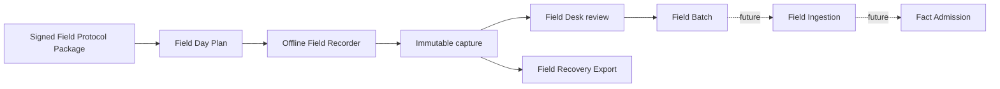

# Field Research Protocol and Data Reference

This reference defines the accepted contract for deterministic offline field planning, capture,
review, recovery, and batch export. The implementation programme is
[issue #237](https://github.com/ametel01/ask-siargao/issues/237).

The local contract is implemented through protected planning, Recorder, Desk, export, restore, and
Legacy Capture recovery surfaces. The active signed package is
`field-protocol-siargao-baseline@1.0.1`. PR #226's `field-record.v1` and embedded-record
`field-batch.v1` shapes remain Legacy Capture and are not authoritative for new work. Server Field
Ingestion and physical iPad/Mac acceptance remain separate boundaries.

## Authority and scope

The source-of-truth order is:

1. `CONTEXT.md` for domain language;
2. ADRs 0026–0029 for durable architecture decisions;
3. canonical machine-readable schemas and registries delivered by
   [issue #238](https://github.com/ametel01/ask-siargao/issues/238);
4. this page for human-readable reference;
5. generated TypeScript bindings and examples, which must match the canonical artifacts.

This contract ends at a verified Field Batch. Server Field Ingestion, PostgreSQL field tables, Fact
Admission, chat retrieval, and publication are separate future contracts.

## Lifecycle



No chat tool or public route may query Recorder, Desk, recovery, legacy, or future staging data
directly.

## Protocol hierarchy

| Concept | Required relationship | Meaning |
| --- | --- | --- |
| Field Campaign | contains Field Assignments | Scoped research programme with one methodology and evidence objective; no fixed schedule required. |
| Field Assignment | belongs to one Campaign | Unscheduled work for one principal Subject, bounded area, or route. |
| Research Objective | belongs to one Assignment | Required question, observation, measurement, attempt, statement, traversal, document, or repetition. |
| Coverage Requirement | belongs to one Objective | A named evidence obligation with requiredness, minimum record count, supporting evidence, and repetition conditions. |
| Eligibility Window | applies to Assignment or Objective | Daypart, weekday class, tide, access, operating, or other conditions for a valid attempt. |
| Partial Coverage Set | belongs to one Assignment | Explicit subset that remains independently valid when the entire Assignment cannot fit. |
| Field Day Plan | selects Assignments | Researcher-confirmed, capacity-bounded grouping for one outing. |
| Field Visit | executes Assignment work | Shared place, time, conditions, and provenance context for captured records. |

## Field Protocol Package

A package manifest pins compatible versions for:

- Campaigns, Assignments, Objectives, Coverage Requirements, and labels;
- record schemas and controlled registries;
- Method Profiles and supported device requirements;
- governed Subjects and Provisional Subject rules;
- areas, corridors, transport modes, transfer boundaries, and conservative duration bands;
- Eligibility Windows, Partial Coverage Sets, fallbacks, and branching rules;
- permission and freshness defaults;
- application compatibility and Protocol Migration declarations.

The manifest has a stable package ID, semantic version, created time, signer/key ID, content hashes,
component versions, compatibility range, and signature. Activation fails on unknown signer, invalid
signature, hash mismatch, incompatible application, or missing migration declaration.

Active Field Plans and Visits remain pinned to their original package. Protocol Migration previews
every change, preserves originals, and sends ambiguous conversions to Needs resolution or Legacy
Capture.

### Canonical artifacts and generated bindings

The repository-owned source is under `field-protocol/canonical/v1/`. The signed manifest pins the
schema catalog, controlled Observation Kind registry, Method Profiles, governed Subjects, Travel
Compatibility Graph, baseline Campaign, help text, examples, and the explicit legacy migration. The
trusted signer registry under `field-protocol/trust/` contains only an Ed25519 public key.

Generated TypeScript under `src/features/field-protocol/generated/` includes one binding per record
schema and a typed value interface for every controlled Observation Kind. Runtime validation in
`src/features/field-protocol/field-protocol.ts` is constructed from the same canonical schemas and
registries; it does not maintain a second handwritten value validator.

Use `bun run field-protocol:generate` after a repository-reviewed package update. A changed signed
package requires the release private key through `--sign-private-key=<path>`; never commit that key.
Use `bun run field-protocol:check` to verify that generated output and content hashes remain stable.

## Planning contract

### Geographic forms

An Assignment declares exactly one primary geographic form:

- governed point Subject;
- bounded governed area;
- origin–destination route;
- route corridor;
- access or pickup point distinct from the Subject.

The Travel Compatibility Graph provides versioned area, corridor, transport, transfer, and
conservative-duration relationships. Live maps or routing are optional preflight evidence, not a
correctness dependency.

Every named baseline item in the accepted Assignment library is a separate Coverage Requirement
linked to one Objective. A captured record carries one exact `coverageRequirementId`; an Objective's
broad Observation Kind set or aggregate record count cannot satisfy an unrelated requirement.
Each requirement declares requiredness, minimum records, supporting-asset policy, repetition, and its
admissible record and Observation Kinds.

### Planner inputs

- governed starting area;
- optional permissioned precise start location;
- transport mode;
- available time;
- safety, documentation, rest, and daylight margins;
- Assignment duration and geography;
- Eligibility Windows and preflight evidence;
- required repetition and outstanding Objective Coverage;
- editorial priority and evidence freshness;
- safe fallback compatibility.

### Deterministic order

After hard safety, permission, eligibility, access, transport, and capacity exclusions, selection uses:

1. rare current Eligibility Window;
2. starting cluster or route-corridor compatibility;
3. outstanding required coverage;
4. editorial priority or older evidence;
5. remaining capacity fit;
6. stable Assignment ID.

The Field Plan Snapshot stores inputs, source retrieval context, exclusions, proposal, researcher
adjustments, resulting coverage effects, protocol versions, and later revisions.

## Common record fields

Every captured record has:

| Field | Required | Meaning |
| --- | --- | --- |
| `id` | yes | Client-generated UUID and immutable identity. |
| `schemaVersion` | yes | Exact canonical record schema. |
| `protocolPackageId` | yes | Pinned Field Protocol Package. |
| `campaignId` | yes | Owning Field Campaign. |
| `assignmentId` | conditional | Originating Field Assignment. |
| `visitId` | conditional | Shared Field Visit context. |
| `researcherId` | yes | Verified Field Researcher identity, never a shared token. |
| `deviceId` | yes | Authorized Field Device reference. |
| `recordedAt` | yes | Durable-entry instant. |
| `localTimezone` | yes | IANA timezone, normally `Asia/Manila`. |
| `supersedesId` | no | Prior immutable record corrected by this record. |
| `captureState` | yes | Draft or Captured; later lifecycle states are not stored here. |

Automatic context includes IDs, times, timezone, protocol, Campaign, Assignment, researcher, device,
Method Profile, and active Visit. Weather, tide, access, crowd, road, or operating state require an
explicit observation or cited preflight source.

## Record types

### Field Visit

A Visit requires one governed Subject, governed area, governed route, or Provisional Subject. It also
records Assignment, start/end times, permissioned location state, Public Location Precision,
structured conditions, Objective links, asset links, and optional Private Context Note.

### Field Observation

An observation is atomic and has exactly one Subject. Required fields include:

- Observation Kind and value-schema version;
- one exact Coverage Requirement link for the active Assignment and Objective;
- directness;
- `observedAt`, `recordedAt`, timezone, offset, and time-correction indicator;
- typed value or controlled negative state;
- Method Profile and structured conditions;
- immutable Raw Measurement and unit when applicable;
- derived Normalized Measurement and conversion version when applicable;
- Capture Confidence and reason when below high;
- caveat and validity when applicable;
- review due time derived from the kind default;
- linked assets, contradictions, comparison group, and supersession;
- independently denied-by-default LLM, article, quotation, and public-use permissions.

The researcher may shorten a freshness window but cannot extend the protocol default.

### Route Run

A Route Run requires defined endpoints, transport mode, request/queue/departure/arrival times as
applicable, stops, party/luggage/access context, booking method, distance and Method Profile, price and
currency when paid, receipt link, conditions, signal checkpoints, access/transfer barriers, and what
was not tested. Duration is derived from timestamps.

### Source Statement

A Source Statement requires Source role and basis of knowledge, the question asked, original language,
exact quotation or labelled paraphrase, attribution choice, capture context, each consent scope,
its independently recorded decision/method/time, validity or recontact window, withdrawal route, and
linked assets.

A Statement Translation is a separate derivative with translator identity or method. Participation,
public location, or one permission never implies another permission.

### Evidence Asset

An asset requires kind, byte size, media type, content hash, capture time, device, purpose, linked
Objectives/records, permitted location, people-present state, rights, consent, redaction state,
retention state, and relationship to any redacted derivative. Filename is not provenance.

The first release supports photos and receipt/document scans. Direct audio and video capture remain out
of scope until their consent, encryption, retention, and deletion contracts are approved.

### Capture Exception

Controlled exception reasons are:

- `access_denied`;
- `unsafe_conditions`;
- `permission_declined`;
- `subject_unavailable`;
- `equipment_failure`;
- `eligibility_changed`;
- `interrupted`;
- `not_applicable`.

Every exception links to its Coverage Requirement, Objective, time, Visit or planning context, and
structured reason details.
An exception explains missing evidence; it does not fabricate Satisfied coverage.

### Schema Gap

A Schema Gap records attempted Subject, time, permitted location, Assignment/Objective, a bounded
description, and optional Evidence Asset. It cannot become Ready for Desk or enter a Field Batch until
a new protocol maps it without distortion.

## Objective and Assignment states

Objective Coverage is derived from linked typed records and exceptions:

- `unstarted`;
- `in_progress`;
- `satisfied`;
- `blocked`;
- `not_applicable` with justification;
- `needs_resolution`.

Field Assignment states are:

- `unscheduled`;
- `planned`;
- `in_progress`;
- `complete`;
- `closed_with_gaps`;
- `needs_attention`.

Complete requires every required Objective to be Satisfied or validly Not Applicable. Capture
Exceptions produce Closed with gaps. Unresolved coverage creates a linked unscheduled Follow-up
Assignment without reopening history. Deferred unstarted work returns unchanged to the pool.

## Capture and review lifecycle

```text
Draft
→ Captured
→ Needs resolution or Ready for Desk
→ Field-reviewed
→ Ready for Export or Excluded
```

Recorder, Desk, future ingestion, and Fact Admission states are separate. A captured record is
immutable. The Field Desk records Include, Exclude with reason, Needs more evidence, or Correct by
supersession. Conflicts and intentional repetitions remain preserved.

Reviewer identity and whether the reviewer matched the researcher are required. Independent review is
preferred where practical but is never fabricated.

## Standard Observation Kinds

| Kind | Required value context | Default review guidance |
| --- | --- | --- |
| `identity` | displayed/official names, aliases, category, resolution evidence | up to 180 days |
| `opening_signal` | open/closed at instant; posted hours separately evidenced | 7–30 days |
| `price` | amount, ISO currency, item, unit, party size, inclusions, posted/quoted/paid basis | 7–30 days |
| `route_duration` | endpoints, mode, timestamps, conditions | 30–90 days |
| `route_wait` | queue start, departure, mode, conditions | 7–30 days |
| `road_condition` | segment, surface, obstruction, weather context | 7–30 days |
| `facility` | facility type, controlled state, instant, access conditions | 30–90 days |
| `accessibility` | measured barrier or feature; never a generic accessible label | 30–90 days |
| `payment_method` | attempted/offered/accepted/rejected method and transaction context | 30 days |
| `connectivity` | network, device, zone, method, repeated down/up/latency values | 7–30 days |
| `power` | socket permission/state, outage, direct versus Source-stated backup | 7–30 days |
| `crowd_snapshot` | count or controlled band, boundary, instant, method | 7 days |
| `noise_snapshot` | measured dBA or controlled subjective band and method | 7 days |
| `weather_condition` | observed condition and separate authoritative source when used | hours |
| `tide_context` | observed shoreline/time and cited official/model source | hours |
| `menu_item` | item, price, availability, dietary disclosure basis | 7–30 days |
| `service_status` | controlled operating state at instant and evidence basis | 1–7 days |
| `contact_channel` | public channel, verification method, permission | 30–90 days |
| `local_caveat` | bounded warning, conditions, directness, corroboration | fact-specific |

These windows are review defaults, not truth guarantees. Safety-critical or unusually volatile
evidence expires sooner. A new protocol version is required to lengthen defaults.

## Cross-cutting controlled values

- Objective Actions: observe, measure, attempt, ask, traverse, document, repeat.
- Capture Confidence: high, medium, low; medium/low require a reason.
- State outcomes distinguish present, absent, available, unavailable, accepted, rejected, not offered,
  not tested, inaccessible, and unknown rather than collapsing to boolean.
- Conditions use governed structured vocabularies for weather, tide, road, crowd, noise, outage,
  access, and disruption.
- Money preserves decimal capture, ISO currency, pricing unit, basis, party size, inclusions, fees,
  negotiation, payment attempt, and receipt linkage.
- Raw values and units remain immutable; normalized values retain conversion lineage.
- Unknown, Not observed, Not applicable, and Capture Exception are schema-specific explicit values.
  Empty strings and placeholders always fail.

## Protected data and authorization

Protected Field Data includes precise location, private Source identity/contact, consent details,
Private Context Notes, and unredacted assets.

- The installable PWA stores protected payloads authenticated-encrypted at rest.
- A time-bounded Offline Field Grant is established through verified online identity and bound to an
  Authorized Field Device.
- Expiry locks rather than deletes evidence.
- A researcher-held Field Recovery Secret provides fallback; there is no administrative bypass.
- Protected payloads never enter PostHog, Sentry, logs, HTTP caches, service-worker caches, or silent
  background requests.
- Location permission may last for the active Visit but remains visible and revocable.
- Public Location Precision is separate from private coordinates.
- Local purge requires exact scope, fresh authorization, audit evidence, and verified recovery or a
  retention/withdrawal requirement.

## Field Recovery Export

A Field Recovery Export is a private authenticated-encrypted backup. It may contain Drafts, Captured
records, unresolved work, Capture Exceptions, Schema Gaps, assets, protocol packages, plan snapshots,
Legacy Capture indexes and opaque encrypted source/preview/decision envelopes, and writer/recovery
metadata needed for restoration.

Its unencrypted outer receipt is limited to format version, encrypted bytes, ciphertext hash,
creation time at the minimum necessary precision, encryption/key identifiers, and restore instructions.
It contains no Campaign, Subject, record count, location, researcher identity, or field-derived
filename.

Restoration is idempotent for identical immutable content. Same-ID/different-content is quarantined.
No restore silently overwrites destination data.

## Field Batch

A Field Batch contains an explicit selection of Included, Field-reviewed, referentially closed records
and required lineage. It may span Field Day Plans.

The authoritative contract requires:

- one batch schema version and UUID;
- Field Protocol Package and component versions;
- reviewer decisions and identity/independence state;
- plural counts by record type;
- separate canonical files by record type;
- per-file byte sizes and cryptographic hashes;
- declared protected assets and relationships;
- Campaign, Assignment, Visit, researcher, correction, conflict, and review lineage;
- deterministic canonicalization and an authenticated-encrypted recipient envelope when Protected
  Field Data is present.

Export fails closed on unresolved Subject, rights, consent, asset hash, conflict disposition, review,
protocol, schema, or referential blockers. JSON is internal interchange only.

## Verified Field Transfer

Routine transfer encrypts to an Authorized Field Device registered through public-key exchange. The
Field Recovery Secret is fallback, not the routine transfer password. Transfer completion requires
recipient decryption, ciphertext and record-hash verification, referential validation, and a receipt
the source verifies.

Large exports use bounded-memory chunking or streaming and never report success after a partial write.
Device revocation prevents future trust without remotely erasing local evidence.

## Legacy Capture

The canonical compatibility route is
`/operator/field/diagnostics-recovery/legacy-import`. It recognizes only exact `field-record.v1`
records, arrays or JSONL containing only that version, and an internally consistent embedded-record
`field-batch.v1`. It rejects missing, unknown, or mixed versions, current `field-batch.v2`, current
encrypted receipts, and generic record envelopes. `field-batch.v1` is historical embedded-record
transport; `field-batch.v2` is the current reviewed graph schema.

Every accepted source is encrypted before protected custody. The deterministic
`legacy-capture-preview.v1` records the signed migration ID, exact source and target versions, source
artifact and canonical-corpus hashes, stable source-record hashes, destination-state hash, additions,
exact replays, same-ID conflicts, rejections, exact mappings, omissions, reference gaps, rights gaps,
validation gaps, Schema Gap candidates, candidate target hashes, and a preview hash. States are
`mappable_preview`, `needs_resolution`, `quarantined_conflict`, and `rejected`; promotion is always
`quarantined_only`.

Historical permission claims cannot grant current LLM, article, quotation, or public use. The same
immutable ID with different canonical content preserves every variant and quarantines the whole
identity. Decisions are append-only and fail if their preview or destination state is stale. No Legacy
Capture becomes Ready for Desk or Ready for Export.

The read-only PR #226 IndexedDB adapter can preserve discoverable rows in encrypted custody. Because
the old database never stored original source bytes, migrated lineage explicitly records
`original_bytes_unavailable`; it never invents an original file hash.

## Future server boundary

Future Field Ingestion may authenticate a Field Batch recipient, allocate quarantine, validate media,
stage records idempotently, and later support separate Field Review and Fact Admission services. It
must use a new issue, API contract, threat model, database migration, and release evidence.

Upload, server receipt, staging, review, admission, agent eligibility, and publication remain distinct
states. No successful local operation implies a later state.

## Current implementation status

Implemented by issue #238 and extended through issue #241:

- signed `field-protocol-siargao-baseline@1.0.1` manifest with component hashes, application
  compatibility, and explicit migration declaration;
- canonical schemas for Field Visit, Field Observation, Route Run, Source Statement, Statement
  Translation, Evidence Asset, Capture Exception, Schema Gap, Field Review, Field Recovery Export,
  and Field Batch;
- all 19 controlled Observation Kinds with typed value schemas, units, required context, Method
  Profiles, and freshness defaults;
- the former itinerary as 13 unscheduled baseline Assignments with Research Objectives, Coverage
  Requirements, Eligibility Windows, Partial Coverage Sets, geographic forms, and safe fallbacks;
- governed Subject subsets, Provisional Subject rules, Travel Compatibility Graph, permission
  defaults, branching guidance, and human-readable help;
- generated TypeScript bindings and validated examples checked by `bun run field-protocol:check`;
- fail-closed record validation, package verification, exact-version work resolution, and explicit
  Protocol Migration previews that preserve originals and quarantine ambiguity.

- Visit-governed local-hour Capture Windows and non-empty window lineage on countable evidence;
- signed positive, satisfying-negative, and unknown coverage dispositions for all 19 Observation
  Kinds, with negative evidence counting toward record minimums;
- canonical Objective Coverage, Assignment Outcome, Follow-up Assignment, and Field Day Close
  records, including the `recovery_required` handoff to issue #242;
- correction lineage for Capture Exception, Schema Gap, and Statement Translation;
- exact pinned-package record validation and the shared Route Run condition vocabulary.

Implemented by issues #239, #240, #241, #242, and #243:

- Field Researcher/Operator account authorization, Authorized Field Devices, device-bound WebAuthn,
  72-hour Offline Field Grants, encrypted local custody, recovery secret verification, clock rollback
  and inactivity locks, storage readiness, and the deny-by-default offline shell;
- deterministic, capacity-bounded unscheduled Field Day planning with stable explanations, explicit
  adjustments, immutable snapshots, and Recorder handoff;
- guided Recorder coverage for every governed record branch and all 19 typed Observation Kinds,
  encrypted autosave/media, immutable capture, derived coverage/outcomes/follow-ups, and Field Day
  Close;
- atomic Recorder-to-Desk custody, append-only Include/Exclude/Needs more evidence/Correct by
  supersession decisions, and distinct reviewed Field Batch and complete Field Recovery artifacts;
- bounded authenticated encryption, recipient-device ECDH, incremental hashes, signed transfer
  receipts, replay prevention, restore preview, exact replay, and quarantine;
- exceptional Legacy Capture preservation, signed migration preview, encrypted source lineage,
  append-only decisions, old-browser discovery, Recovery index/restore, and the temporary protected
  `/admin/field-ingestion` redirect/rollback alias.

Not implemented or not yet accepted:

- physical iPad/Mac usability, Files/AirDrop transfer, recovery, accessibility, and cross-device
  evidence required by issue #244;
- independent security/privacy/rights review and eligible non-author maintainer approval;
- server Field Ingestion, PostgreSQL capture tables, Fact Admission, agent retrieval, or publication.

Do not hand-author JSON as production field capture and do not insert field material directly into
production facts.

## Related documentation

- [Run Siargao field research](../how-to-guides/run-siargao-field-research.md)
- [Deterministic Field Workspace](../explanation/deterministic-field-workspace.md)
- [Recover Legacy Capture](../how-to-guides/recover-legacy-capture.md)
- [Siargao fieldwork official source pack](siargao-fieldwork-source-pack-2026-08-16.md)
